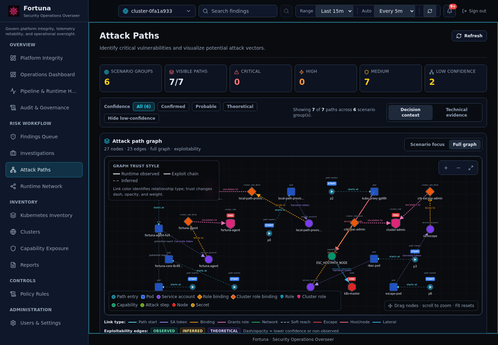

# Fortuna

### Find the pods that can take over your Kubernetes cluster, and see exactly how.

Fortuna maps every workload to the permissions it really holds: **pod → ServiceAccount → RoleBinding → Role → what that lets an attacker do**. It shows the full path in one view, together with the vulnerabilities and runtime activity of the same pod, so you can decide what to fix first.

[](LICENSE)
[](https://github.com/shino-337/Fortuna-Community/actions/workflows/ci.yml)

[Try it locally](#try-it-locally) · [Screenshots](docs/user-guide/README.md#workspace-screenshots) · [First investigation](docs/getting-started/FIRST_FINDING.md) · [Website](https://fortunahub.dev)



## Why

Most Kubernetes clusters have a few workloads that are one `kubectl exec` away from `cluster-admin`, and nobody knows which ones. RBAC is spread across Roles, ClusterRoles and bindings, so a dangerous grant is easy to miss in review:

```yaml
# Looks harmless on its own...
kind: ClusterRoleBinding
metadata: { name: crb-rbac-admin }
roleRef: { kind: ClusterRole, name: cluster-admin }
subjects:
  - { kind: ServiceAccount, name: sa-rbac, namespace: fortuna-test }
# ...until a pod runs as sa-rbac. Anyone who compromises that pod owns the cluster.
```

Fortuna answers, per pod:

- **Can this pod's identity reach cluster-wide access?** And through which bindings?
- **What could an attacker do next?** Read Secrets, create pods, escalate RBAC, reach the node.
- **Is it also exploitable?** Known CVEs in the same pod's images, and runtime signals when a sensor is available.
- **Did my fix work?** Remove the binding and watch the path disappear after the next inventory sync.

## Try it locally

You need Docker, [kind](https://kind.sigs.k8s.io/), `kubectl` and `openssl`. Everything runs in a throwaway local cluster with its own kubeconfig.

```bash
git clone https://github.com/shino-337/Fortuna-Community.git
cd Fortuna-Community
./scripts/demo/up.sh
```

The script installs Fortuna from published images, loads an example pod whose ServiceAccount is bound to `cluster-admin`, and prints the dashboard URL and login. The first run takes a few minutes while images are pulled and the database is migrated. See the [demo guide](docs/getting-started/DEMO.md) for options and troubleshooting, then follow [your first investigation](docs/getting-started/FIRST_FINDING.md). Clean up with `./scripts/demo/down.sh`.

## How it compares

Fortuna is workload-centric: it starts from a running pod and asks what its identity can reach. It is not a compliance scanner.

| Tool | Main focus |
|---|---|
| **Fortuna** | Per-workload RBAC attack paths, combined with the same pod's vulnerabilities and runtime evidence, in one investigation UI |
| [KubeHound](https://github.com/DataDog/KubeHound) | Cluster-wide attack graph built for graph queries |
| [Kubescape](https://github.com/kubescape/kubescape) | Posture and compliance scanning against frameworks (NSA, CIS, MITRE) |
| [rbac-police](https://github.com/PaloAltoNetworks/rbac-police) / [KubiScan](https://github.com/cyberark/KubiScan) | Enumerate risky RBAC permissions from the command line |
| [Trivy Operator](https://github.com/aquasecurity/trivy-operator) | Continuous vulnerability and misconfiguration reports |

They work well together: use a scanner for broad coverage, and Fortuna to investigate which workload findings actually lead somewhere.

## What you get

| Area | What you can inspect |
|---|---|
| Attack paths | Workload-specific chain from pod to granted permissions, with missing edges and path classification |
| RBAC inventory | Pods, ServiceAccounts, Roles, bindings and dangerous verbs, per cluster |
| Vulnerabilities | Workload SBOM, package matching and CVE evidence |
| Runtime | Falco/agent telemetry linked to the static posture of the same pod |
| Prioritization | The factors behind each workload's risk score |
| Remediation | Reviewed, previewed revocation of a ServiceAccount's bindings |

An inferred permission path shows what is **possible**, not proof that an attacker used it. Runtime confirmation needs matching telemetry.

## How it works

```
 Agent (DaemonSet) ──HTTP/gRPC──▶ Core (API, correlation) ──▶ PostgreSQL + NATS
   inventory, SBOM, runtime            │
                                       ▼
                                 Dashboard (web UI)
```

The Agent collects Kubernetes inventory, image SBOMs and available runtime events and sends them to Core. Core correlates them into findings and attack paths; the dashboard is where you investigate. See [Architecture](docs/architecture/ARCHITECTURE.md).

## Before you install in a real cluster

Start in a disposable cluster. Read these first:

- **Agent privileges.** The Agent has read-only RBAC (no Secrets, no `pods/exec`), adds no Linux capabilities and reads the host `/proc`. Only a small sidecar without credentials touches the containerd socket, which is still root-equivalent on the node. CI fails if the manifests grant more. See [Agent privileges](docs/reference/SECURITY.md#agent-privileges).
- **Runtime coverage** depends on your sensors. The built-in eBPF sensor is an experimental scaffold, not a real exec/connect collector; Falco ingestion is a separate path. Keep `EBPF_SIMULATE` disabled for real evidence.
- **Not yet modeled:** external ingress-to-workload reachability, network reachability correlation and business-context weighting (see the [roadmap](ROADMAP.md)).
- This README tracks `main`. The latest release is [v1.0.0](https://github.com/shino-337/Fortuna-Community/releases/tag/v1.0.0); use the docs and manifests from that tag for it.

For a full installation (secrets, mTLS, storage, rollout), follow the [Quickstart](docs/getting-started/QUICKSTART.md) and the [environment requirements](docs/getting-started/ENVIRONMENT_REQUIREMENTS.md).

## Documentation

| Need | Guide |
|---|---|
| Everything, by task | [Documentation index](docs/README.md) |
| Install on a cluster | [Install guide](docs/getting-started/QUICKSTART.md) |
| Dashboard workflows | [User guide](docs/user-guide/README.md) |
| Architecture and multi-cluster model | [Architecture](docs/architecture/ARCHITECTURE.md) |
| Production operations | [Operations](docs/operations/PRODUCTION_DEPLOYMENT.md) |
| Validation scenarios | [Scenarios](scenarios/README.md) |
| Behavior contracts, security model and invariants | [Reference](docs/README.md#reference) |

## Contributing

Bug reports, detection scenarios and documentation fixes are welcome; see [CONTRIBUTING.md](CONTRIBUTING.md). When reporting a problem, include your Fortuna and Kubernetes versions, the step that failed, and what you expected. Remove credentials and cluster data first.

If Fortuna helped you find something, a star helps other people find it too.

Report vulnerabilities through [SECURITY.md](SECURITY.md). Licensed under [Apache-2.0](LICENSE).
