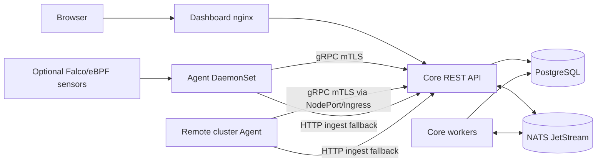
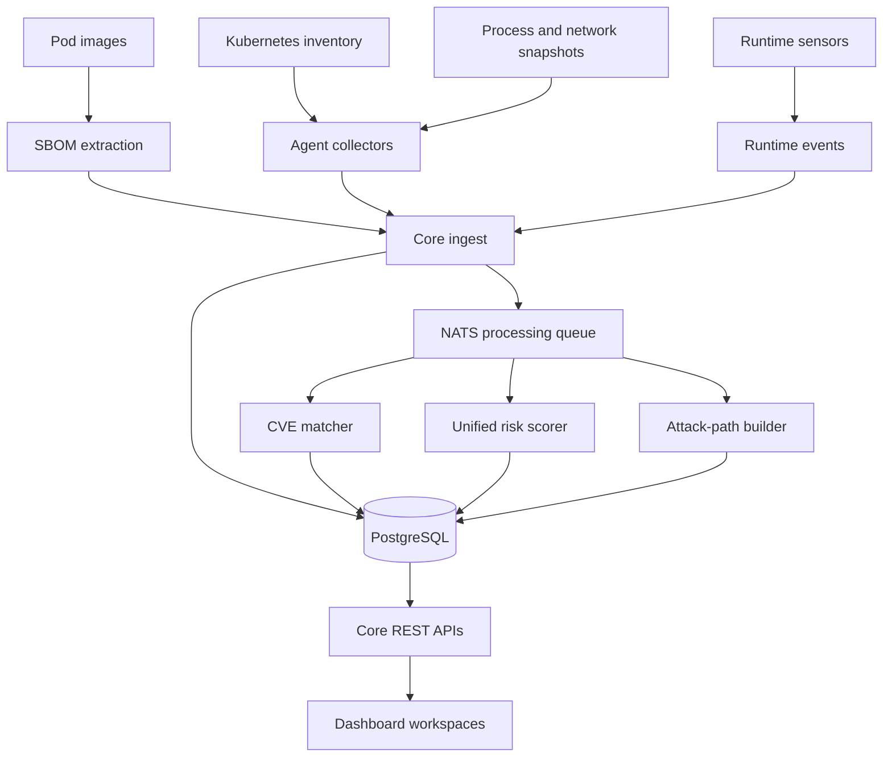
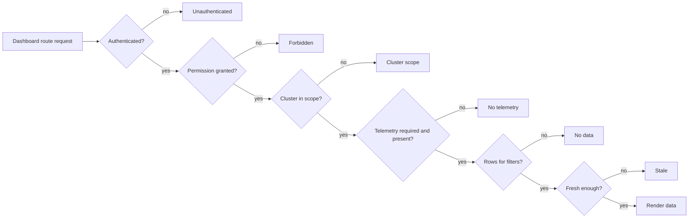

# Architecture

Fortuna is a Kubernetes security platform for workload inventory, SBOM/CVE visibility, runtime telemetry, policy/rule evidence, attack-path analysis, and unified risk operations.

This document describes the current public architecture. It intentionally avoids phase notes, internal backlog, and design-system gap tracking.

## Runtime Topology

Dashboard is a projection of Core APIs. Agent and optional sensors write evidence into Core; Core persists source-of-truth state and publishes asynchronous processing work through NATS JetStream.

In multi-cluster deployments, Core/Dashboard/PostgreSQL/NATS run once in the management cluster. Remote clusters run Agent only. Every inventory, SBOM, runtime, network, risk, and attack-path record is owned by `cluster_id`; dashboard cluster totals are computed from active cluster-scoped records.

## Workloads

| Workload | Kubernetes Shape | Responsibility |
|----------|------------------|----------------|
| Core | Deployment + Service | REST API, gRPC ingest, migrations, workers, CVE matching, unified risk, policy/rule APIs, runtime ingest |
| Agent | DaemonSet | Per-node pod inventory, SBOM extraction, pod detail snapshots, process/network collection, optional Falco/eBPF input |
| Dashboard | Deployment + Service | React/Vite UI served by nginx, `/api/*` proxy to Core |
| PostgreSQL | Deployment + PVC | Primary data store; bundled manifests support standard PostgreSQL or PostgreSQL with Apache AGE |
| NATS JetStream | StatefulSet | Async queue for SBOM and event processing |

## Data Ownership

PostgreSQL is the source of truth for user-visible state. Dashboard pages should be treated as projections of Core API data, not as independent state machines.

Cluster identity is part of the primary data contract. Agent either auto-discovers a stable cluster id from the Kubernetes API or uses explicit `CLUSTER_ID` / `CLUSTER_NAME` overrides. Core upserts clusters by id and never uses display name as ownership identity.

| Data Area | Source | Used By |
|-----------|--------|---------|
| Inventory | Agent pod sync and Kubernetes API observations | Resources, Pod Detail, Monitoring, Risk |
| SBOM | Agent image/package extraction | Pod Detail, CVE, Reports, Risk |
| CVE matches | Core matcher against loaded CVE catalog | Risk, Pod Detail, Reports |
| Runtime events | Falco/eBPF/agent facts through runtime ingest | Monitoring, Pod Detail, Attack Analysis, Risk |
| Network activity | Agent runtime observations | Network Activity, Pod Detail, Attack Analysis |
| Rules | Policy/rule catalog and mapped legacy identifiers | Policy Rules, Risk evidence |
| Risk | Core unified scorer | Dashboard, Risk Operations, Resources, Pod Detail |
| Reports | Core report APIs scoped by role, cluster, and time | Reports |

## Core Data Flows

### Inventory And Pod Detail

1. Agent watches pods on each node.
2. Agent sends pod metadata, specs, runtime snapshots, network observations, and events.
3. Core upserts inventory and pod detail records.
4. Core scopes pod cleanup to the cluster whose Kubernetes API it can actually observe. Remote cluster records are not deleted by management-cluster ghost cleanup.
5. Dashboard reads through Core APIs and must distinguish no data from missing telemetry or missing permission.

### SBOM And CVE

1. Agent extracts SBOM data for observed images.
2. Core persists package/component records.
3. Core matches packages against the CVE catalog stored in PostgreSQL.
4. CVE evidence feeds pod detail, reports, findings, and unified risk.

After a DB reset, an empty CVE view is not proof of a clean image until catalog load and SBOM ingestion have been verified.

### Unified Risk

Core exposes one user-facing risk result for resources and findings. Inputs may include:

- CVE/SBOM evidence.
- Pod configuration and capability signals.
- RBAC and attack-path context.
- Runtime and network evidence.
- Rule matches and workflow state.
- Data freshness and telemetry health where relevant.

UI pages should display the same unified risk level/score across overview, resource list, pod detail, reports, and finding detail.

### Attack Paths

Attack paths are generated from relationships between workloads, identities, RBAC, network observations, runtime evidence, and sensitive objectives. The graph is a navigation surface; detail panes should carry the longer evidence text.

### Runtime Monitoring

Runtime visibility depends on sensor configuration and agent health. Monitoring must make these states explicit:

- Runtime sensor disabled or not installed.
- Sensor enabled but no events observed.
- Events received and processed.
- Telemetry stale or blocked.

## Dashboard Contract

The dashboard should consistently render these states for every protected route:

| State | Meaning |
|-------|---------|
| Unauthenticated | No valid JWT/session; user must sign in |
| Forbidden | Authenticated user lacks required permission |
| Cluster scope | User has route access but not the selected cluster/scope |
| No telemetry | Route is allowed but required agent/runtime data is missing |
| No data | Request succeeded and current filters/time window have no matching records |
| Stale | Data exists but freshness checks indicate it may not reflect current runtime |

Implementation should reuse dashboard primitives where possible:

- `dashboard/design-system/layouts/PageContainer.tsx`
- `dashboard/design-system/components/PageStatus.tsx`
- `dashboard/design-system/components/SemanticEmptyState.tsx`
- `dashboard/design-system/components/FilterBar.tsx`
- `dashboard/design-system/components/Table.tsx`
- shared form/table chrome in `dashboard/lib/`

Detailed visual design guidance is not published in this repo documentation.

## API Shape

Core routes are grouped by product domain:

| Domain | Prefix | Purpose |
|--------|--------|---------|
| Auth | `/api/v1/auth/*` | Login and session actions |
| Dashboard | `/api/v1/dashboard/*` | Summary data for overview pages |
| Inventory | `/api/v1/inventory/*` | Resources, pods, capabilities |
| Risk | `/api/v1/risk/*` | Findings, scores, risk workflows |
| Policy | `/api/v1/policy/*` | Rule catalog and policy metadata |
| Runtime | `/api/v1/runtime/*`, `/api/v2/runtime/*` | Events, network, runtime visibility |
| SBOM | `/api/v1/inventory/sbom`, `/api/v1/inventory/pods/:uid/sbom` | SBOM and CVE evidence |
| Cluster | `/api/v1/inventory/clusters/*`, `/api/v1/cluster/*` | Cluster list, detail, and operational cluster endpoints |
| Agent | `/api/v1/agent/*` | Agent ingest endpoints |

See [API_STANDARD.md](API_STANDARD.md) for response conventions.

## Repository Map

| Path | Purpose |
|------|---------|
| `agent/` | Node agent Go module |
| `api/` | gRPC definitions and generated code |
| `core/` | Core API, workers, models, migrations |
| `dashboard/` | React/Vite dashboard |
| `deploy/` | Kubernetes manifests and deployment examples |
| `scripts/` | Build, deploy, verify, and utility scripts |
| `docs/` | Public documentation |

## Related Docs

- [Component catalog](../03-components/README.md)
- [User guide](../04-user-guide/README.md)
- [Production deployment](../05-operations/PRODUCTION_DEPLOYMENT.md)
- [Security guide](../06-reference/SECURITY.md)
