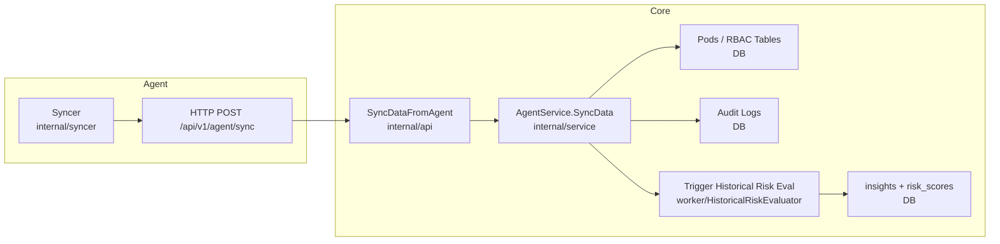

# Agent → Core Flow (Module‑Level)

This document provides a **module‑level flow** from Agent to Core, including SBOM, CVE, and Risk paths.

---

## 1) SBOM + CVE Pipeline

```mermaid
flowchart LR
  subgraph Agent
    A1[LocalPodWatcher<br/>internal/watcher] --> A2[SBOM Work Queue<br/>internal/sbom]
    A2 --> A3[SBOM Processor<br/>internal/sbom]
    A3 --> A4[SBOM Extractor<br/>pkg/sbom/extractor]
    A3 --> A5[gRPC Client (mTLS)<br/>internal/client]
  end

  subgraph Core
    C1[gRPC SBOM Handler<br/>internal/grpc] --> C2[SBOM + Components<br/>DB]
    C1 --> C3[NATS Publish<br/>fortuna.sbom.created]
    C4[CVEMatcherWorker<br/>pkg/worker] --> C5[CVE Matching<br/>pkg/cve]
    C4 --> C6[cve_matches + insights<br/>DB]
  end

  A5 --> C1
  C3 --> C4
```

**Notes**
- SBOM is stored once per image digest; repeated pods update usage counters.
- CVE matching only runs when NATS is available.

---

## 2) Auto‑Sync (RBAC / Inventory)



**Notes**
- Syncer runs full sync on schedule; linkedPods are computed for ServiceAccounts.
- Historical risk evaluation is also scheduled periodically.

---

## 3) Normalized Event Pipeline (Optional / NATS)

```mermaid
flowchart LR
  subgraph Agent
    E1[Legacy Collector<br/>internal/collector] --> E2[InventoryItem Stream]
  end

  subgraph Core
    F1[CorrelatorWorker<br/>pkg/worker] --> F2[Pods/RBAC DB]
    F1 --> F3[Graph (AGE)<br/>pkg/graph]
    F4[RiskWorker<br/>pkg/worker] --> F5[Risk Engine<br/>pkg/riskengine]
    F5 --> F6[insights DB]
  end

  E2 --> F1
  E2 --> F4
```

**Notes**
- This path is **legacy** in Agent (collector is not wired by default).
- Core still supports the normalized pipeline if messages are produced.

