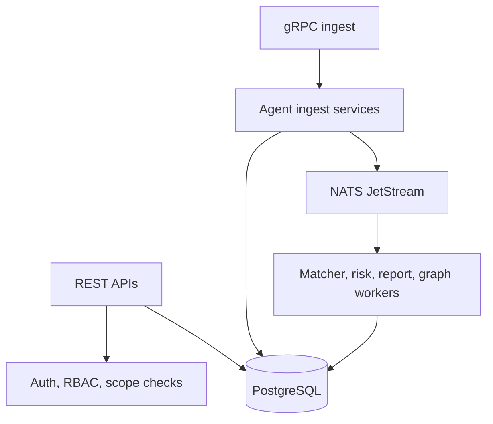
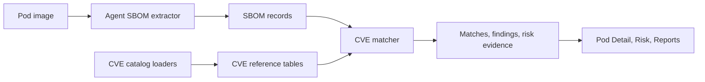
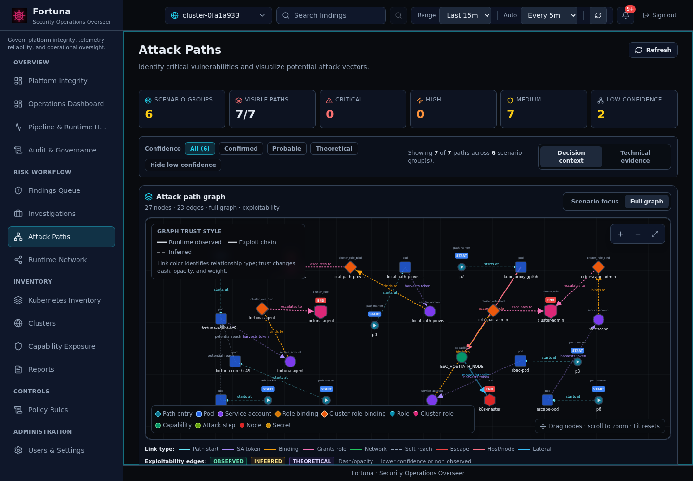

# Component Reference

This reference gives slightly more implementation detail than the component index while staying focused on public operation.

## Core

Core owns the API, database migrations, worker lifecycle, risk evaluation, CVE matching, rule catalog APIs, runtime event ingest, and agent synchronization.

Operational checks:

- `/healthz` should respond after PostgreSQL and NATS are reachable.
- Core migrations run at startup.
- Database-related errors in Core logs usually indicate missing migrations, stale data, or a secret/database mismatch.

## Agent

Agent runs on each node and is responsible for:

- Kubernetes pod discovery.
- SBOM extraction from image/container data.
- Pod detail snapshots: processes, metrics, events, and network observations.
- Runtime sensor ingestion when Falco or eBPF integrations are enabled.

If the dashboard has no pod detail or runtime data, verify the agent DaemonSet, its Core connection, and node-level permissions first.

## Dashboard

The dashboard is a single-page app. User-facing pages should distinguish:

- **Unauthenticated**: session missing or expired.
- **Forbidden**: role lacks permission.
- **Cluster scope**: user can use the route but not the selected cluster.
- **No data**: request succeeded but current filters or ingestion produced no rows.

Primary screenshot references:

| Area | Screenshot |
|------|------------|
| Platform and health | [Platform Integrity](../assets/screenshots/platform-integrity.png), [Pipeline & Runtime Health](../assets/screenshots/monitoring.png) |
| Security workflow | [Findings Queue](../assets/screenshots/risk-operations.png), [Attack Paths](../assets/screenshots/attack-analysis.png) |
| Runtime and inventory | [Runtime Network](../assets/screenshots/network-activity.png), [Kubernetes Inventory](../assets/screenshots/resources.png) |
| Governance outputs | [Policy Rules](../assets/screenshots/policy-rules.png), [Reports](../assets/screenshots/reports.png) |

## SBOM And CVE

SBOM data is collected by the agent and stored by Core. CVE matching depends on the local CVE catalog being loaded into PostgreSQL. After a DB reset, verify catalog status before treating an empty CVE view as a clean image.

Useful operations:

- Run the CVE loader when the catalog is empty.
- Confirm SBOM records exist for the target pod image.
- Compare package names, versions, ecosystem, and source fields when matcher output looks wrong.

## Runtime And Network

Runtime Network uses runtime observations. External destinations should be visually distinct from links/edges and from workload nodes. Runtime event pages should show whether sensors are disabled, enabled but quiet, or posting events.

## Attack Paths

Attack paths should prioritize high-signal information:

- Source workload and namespace.
- Target or objective.
- Key RBAC/network/runtime edge.
- Confidence and evidence type.
- Linked findings and affected resources.

Long narrative text belongs in detail panels, not graph labels or dense tables.

