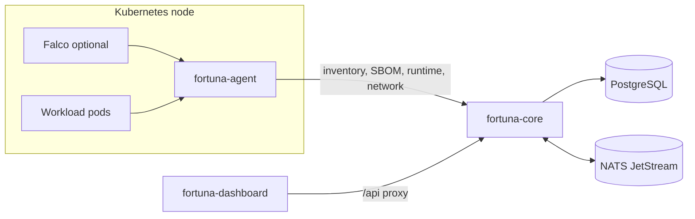
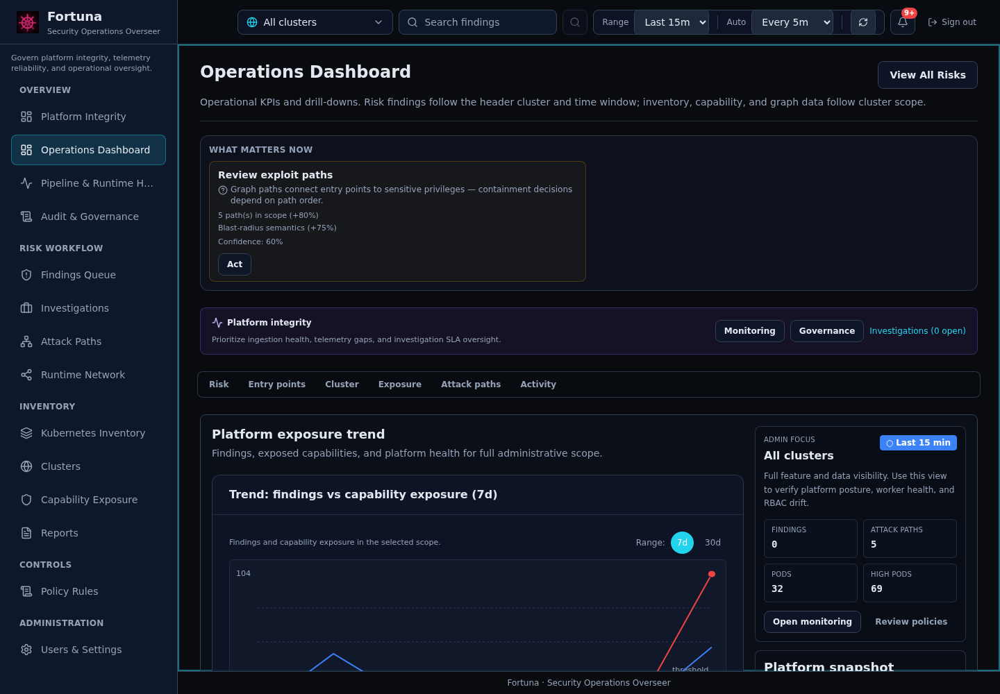
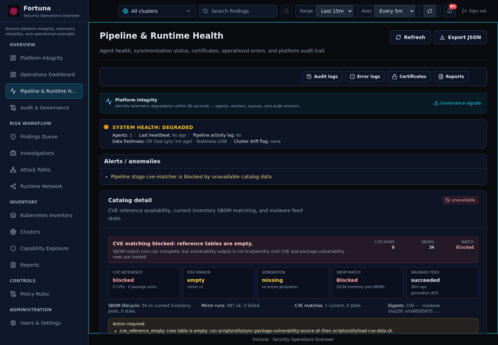
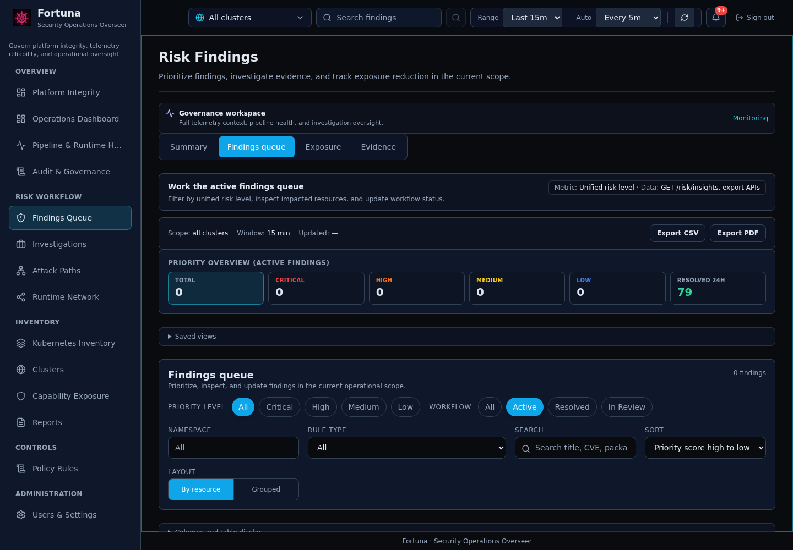
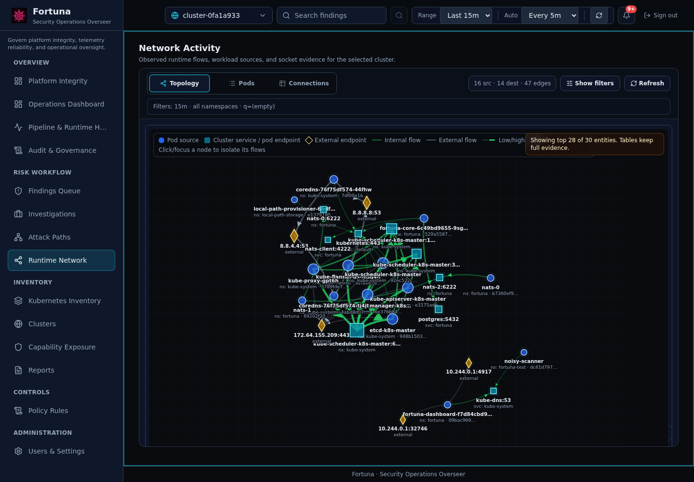
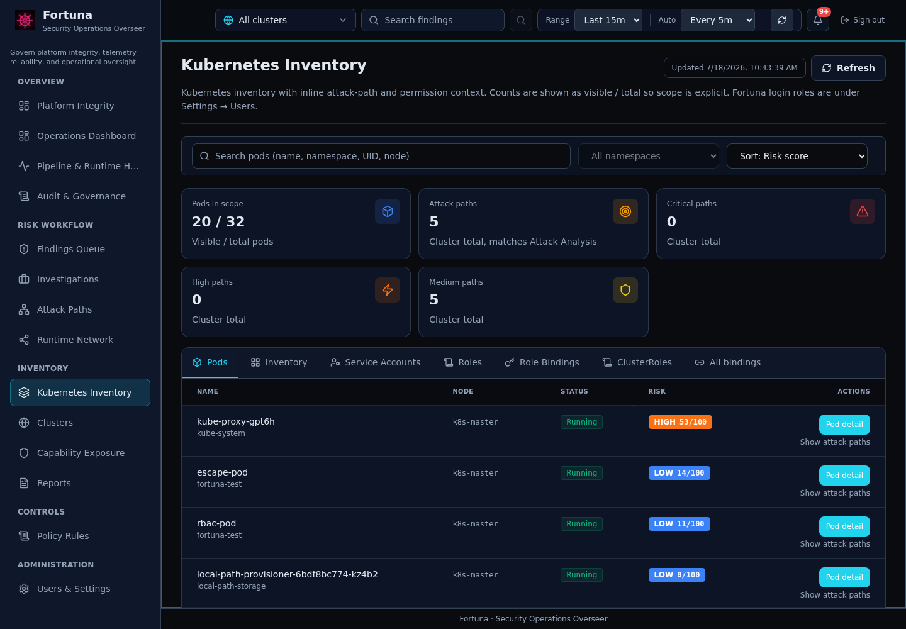
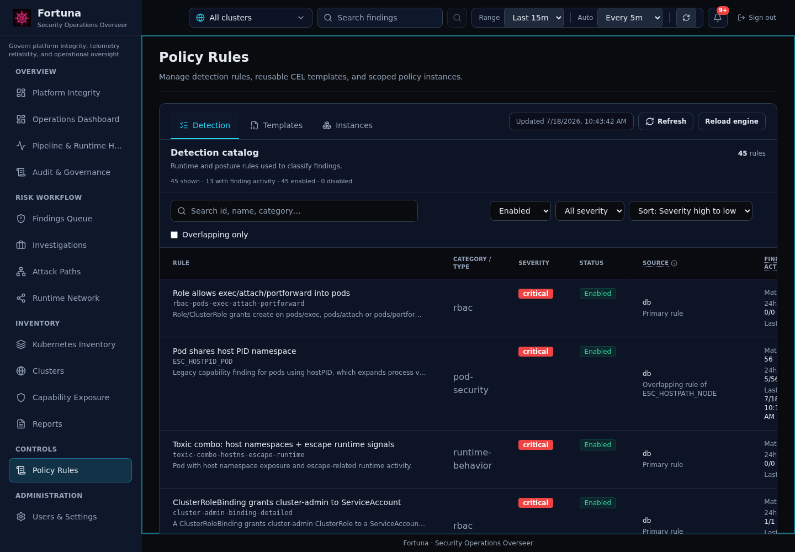
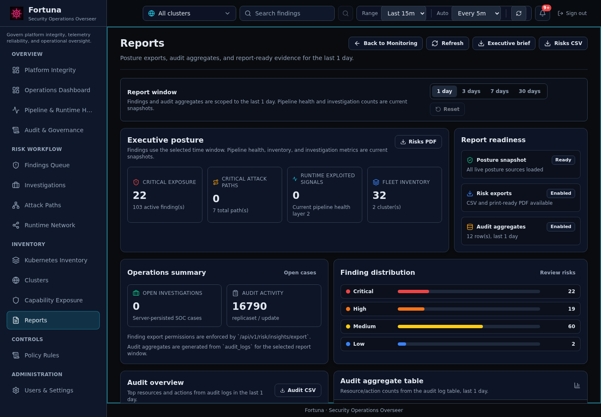

# Components

This page is the public component catalog for Fortuna. It explains what each major subsystem does and where to look in the code.

## Runtime Workloads



| Component | Kubernetes shape | Code | Purpose |
|-----------|------------------|------|---------|
| Core | Deployment + Service | `core/` | REST API, gRPC ingest, workers, migrations, risk, policy, runtime and SBOM processing |
| Agent | DaemonSet | `agent/` | Per-node inventory, SBOM extraction, runtime snapshots, network observations, optional Falco/eBPF event ingestion |
| Dashboard | Deployment + Service | `dashboard/` | React UI served by nginx; proxies `/api/*` to Core |
| PostgreSQL | Deployment + PVC | `deploy/infrastructure/postgresql-with-age.yaml` | Source of truth for inventory, SBOM, CVE, risk, runtime, users, and reports |
| NATS JetStream | StatefulSet | `deploy/infrastructure/nats.yaml` | Async processing queue for SBOM and event pipelines |

## Product Domains

| Domain | What It Shows | Primary Data |
|--------|---------------|--------------|
| Platform Integrity | Telemetry freshness, runtime coverage, governance, pipeline health | Core status, agent sync, runtime visibility, DB-derived pipeline state |
| Findings Queue | Current findings and one unified user-facing risk value | `risk_scores`, insights, rules, runtime/CVE/path evidence |
| Attack Paths | Paths from workload to sensitive targets | RBAC graph, pod/service account links, network/runtime evidence |
| Kubernetes Inventory / Pod Detail | Workload inventory and detail evidence | Pods, containers, SBOM, CVE, processes, network, events |
| Runtime Network | Runtime topology and external destinations | Agent network observations and runtime APIs |
| Policy Rules | Rule catalog, matching metadata, linked findings | Rule catalog APIs and legacy rule mappings |
| Pipeline & Runtime Health | Pipeline, agent, runtime sensor, and data freshness status | Core health, DB pipeline state, agent/runtime telemetry |
| Reports | Time-windowed operational summaries | Findings, resources, runtime events, posture summaries |

## Dashboard Screenshots

The screenshots below are representative captures from a local deployment. Use them to identify the workspace shape; counts and status labels depend on your cluster data.

| Workspace | Screenshot |
|-----------|------------|
| Platform Integrity |  |
| Operations Dashboard |  |
| Pipeline & Runtime Health |  |
| Findings Queue |  |
| Attack Paths |  |
| Runtime Network |  |
| Kubernetes Inventory |  |
| Policy Rules |  |
| Reports |  |

## Risk Model

The dashboard should display a single risk score/level for a resource or finding. That score is computed by Core and may include:

- CVE and SBOM evidence.
- Kubernetes configuration and capability signals.
- RBAC and attack-path context.
- Runtime events and corroboration.
- Workflow state and data freshness.

Avoid mixing legacy severity labels with the unified risk level in user-facing UI.

## Rule And Policy Model

Policy Rules is the user-facing rule catalog. Rule detail URLs use stable rule UIDs:

```text
/#/rules/uid/<rule_uid>
```

Older code-based rule identifiers may still appear in imported data, but UI and API detail links should prefer UIDs.

## Runtime Sensors

Falco is optional. When installed and enabled, events should be visible in Pipeline & Runtime Health, Pod Detail, Findings Queue, and related attack steps. A quiet runtime event page means either no events arrived or runtime sensors are not enabled; Pipeline & Runtime Health should make that distinction clear.

## Related Docs

- [Architecture](../02-architecture/ARCHITECTURE.md)
- [User guide](../04-user-guide/README.md)
- [Use cases](../04-user-guide/USE_CASES.md)
- [Operations](../05-operations/DEPLOYMENT.md)
