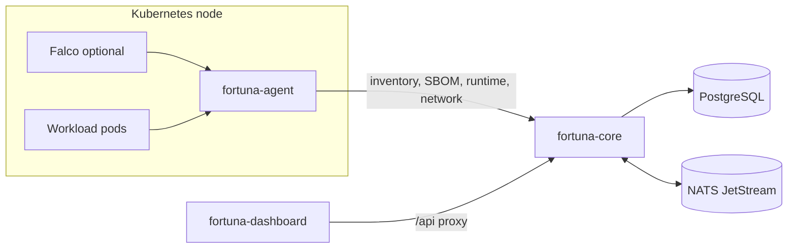
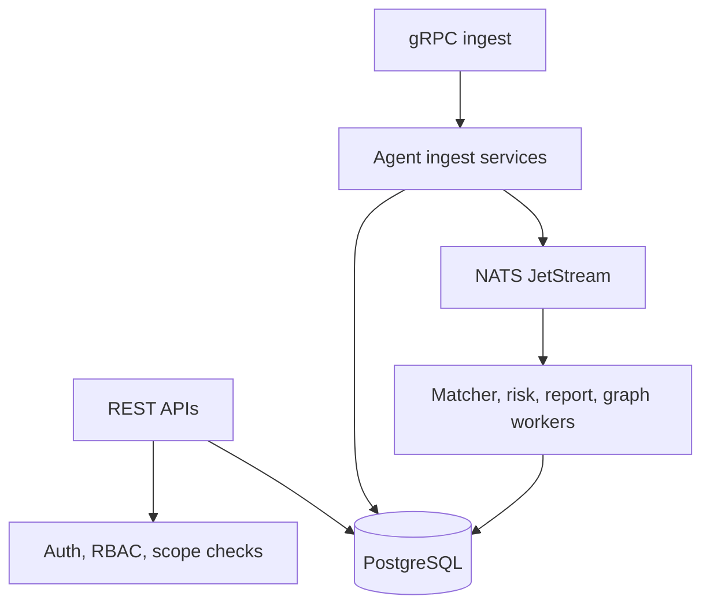
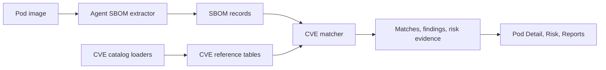

# Components

What each part of Fortuna does, where its code lives, and what to check when it misbehaves. For data flows across components, see [Architecture](../02-architecture/ARCHITECTURE.md); for the dashboard workspaces and screenshots, see the [user guide](../04-user-guide/README.md).

## Runtime workloads

```mermaid
flowchart LR
  subgraph node[Kubernetes node]
    agent[fortuna-agent]
    falco[Falco optional]
    workloads[Workload pods]
    falco --> agent
    workloads --> agent
  end
  agent -->|inventory, SBOM, runtime, network| core[fortuna-core]
  dashboard[fortuna-dashboard] -->|/api proxy| core
  core --> postgres[(PostgreSQL)]
  core <--> nats[(NATS JetStream)]
```

| Component | Kubernetes shape | Code | Purpose |
|-----------|------------------|------|---------|
| Core | Deployment + Service | `core/` | REST API, gRPC ingest, workers, migrations, risk, policy, runtime and SBOM processing |
| Agent | DaemonSet | `agent/` | Per-node inventory, SBOM extraction, runtime snapshots, network observations, optional Falco/eBPF ingestion |
| Dashboard | Deployment + Service | `dashboard/` | React UI served by nginx; proxies `/api/*` to Core |
| PostgreSQL | Deployment + PVC | `deploy/infrastructure/postgresql-with-age.yaml` | Source of truth for inventory, SBOM, CVE, risk, runtime, users and reports |
| NATS JetStream | StatefulSet | `deploy/infrastructure/nats.yaml` | Async queue for SBOM and event pipelines |

### Core

Core owns the API, database migrations, worker lifecycle, risk evaluation, CVE matching, rule catalog APIs, runtime event ingest and Agent synchronization.

```mermaid
flowchart TD
  rest[REST APIs] --> auth[Auth, RBAC, scope checks]
  grpc[gRPC ingest] --> ingest[Agent ingest services]
  ingest --> db[(PostgreSQL)]
  rest --> db
  ingest --> queue[NATS JetStream]
  queue --> workers[Matcher, risk, report, graph workers]
  workers --> db
```

`/healthz` responds once PostgreSQL and NATS are reachable; migrations run at startup. Database errors in Core logs usually mean missing migrations, stale data or a mismatch between the secret and the database.

### Agent

The Agent runs on each node: pod discovery, SBOM extraction from container images, pod detail snapshots (processes, metrics, events, network) and runtime sensor ingestion. If the dashboard shows no pod detail or runtime data, check the DaemonSet, its connection to Core and its node-level permissions first.

The built-in eBPF sensor is experimental: it attaches no-op tracepoints and reports attach health, but does not collect real exec/connect events. `EBPF_SIMULATE=true` generates synthetic events and is never evidence of observed behavior. Falco ingestion is the supported runtime path.

### Dashboard

Pages distinguish four empty states: **unauthenticated** (session missing or expired), **forbidden** (role lacks permission), **cluster scope** (the route is allowed but not for the selected cluster) and **no data** (the request succeeded with no rows).

## Product domains

| Domain | What it shows | Primary data |
|--------|---------------|--------------|
| Platform Integrity | Telemetry freshness, runtime coverage, governance, pipeline health | Core status, Agent sync, runtime visibility |
| Findings Queue | Current findings and one unified risk value | `risk_scores`, insights, rules, runtime/CVE/path evidence |
| Attack Paths | Paths from a workload to sensitive targets | RBAC graph, pod/ServiceAccount links, network/runtime evidence |
| Kubernetes Inventory / Pod Detail | Workload inventory and per-pod evidence | Pods, containers, SBOM, CVE, processes, network, events |
| Runtime Network | Runtime topology and external destinations | Agent network observations |
| Policy Rules | Rule catalog, matching metadata, linked findings | Rule catalog APIs |
| Pipeline & Runtime Health | Pipeline, Agent, sensor and data freshness | Core health, pipeline state, Agent telemetry |
| Reports | Time-windowed summaries | Findings, resources, runtime events, posture |

## SBOM and CVE

```mermaid
flowchart LR
  pod[Pod image] --> agent[Agent SBOM extractor]
  agent --> sbom[SBOM records]
  catalog[CVE catalog loaders] --> cve[CVE reference tables]
  sbom --> matcher[CVE matcher]
  cve --> matcher
  matcher --> findings[Matches, findings, risk evidence]
  findings --> ui[Pod Detail, Risk, Reports]
```

CVE matching needs the catalog loaded into PostgreSQL (`./scripts/utils/load-cve-data.sh`). After a database reset, check the catalog before treating an empty CVE view as a clean image. When a match looks wrong, compare package name, version, ecosystem and source fields.

## Attack paths

An attack path shows the source workload and namespace, the target or objective, the key RBAC, network or runtime edge, its confidence and evidence type, and linked findings. A path is an inference of what is possible; runtime confirmation requires matching telemetry. See [graph and runtime boundaries](../06-reference/GRAPH_RUNTIME_BOUNDARIES.md).

## Risk model

Each resource or finding shows a single risk score and level computed by Core. It can combine CVE and SBOM evidence, Kubernetes configuration and capability signals, RBAC and attack-path context, runtime corroboration, workflow state and data freshness.

## Rules and policy

Policy Rules is the rule catalog. Rule detail links use stable rule UIDs (`/#/rules/uid/<rule_uid>`); older code-based identifiers may still appear in imported data.

## Runtime sensors

Falco is optional. When enabled, its events appear in Pipeline & Runtime Health, Pod Detail, the Findings Queue and related attack steps. Pipeline & Runtime Health tells apart "no events arrived" from "no sensor is enabled".
