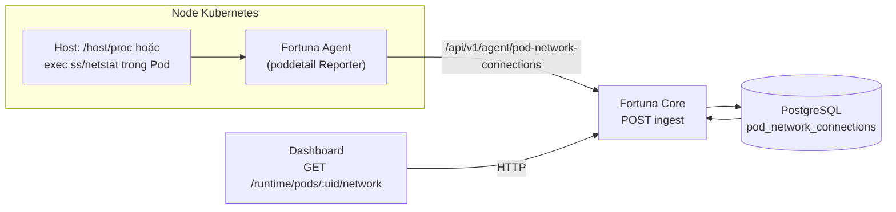

# Network Activity — Component Fortuna (triển khai hiện tại)

Tài liệu này mô tả **component Network Activity đang chạy trong codebase** (Agent Pod Detail → Core API → PostgreSQL → Dashboard Pod Detail). Nó bổ sung và đối chiếu với [`networkActivity_Spec.md`](./networkActivity_Spec.md) — file spec kia chủ yếu là **hướng tiến hóa** (eBPF, Redis/TimescaleDB, graph thời gian thực) chưa được triển khai đầy đủ như sơ đồ trong đó. **Để tránh lệch kỳ vọng**, đọc **mục 8 (Roadmap vs shipped)** trước khi lập kế hoạch dựa trên spec dài.

---

## 1. Vai trò trong sản phẩm

| Khía cạnh | Mô tả |
|-----------|--------|
| **Mục tiêu** | Cho phép vận hành xem **snapshot kết nối mạng theo Pod** (tuple IP/port/protocol/state), nguồn thu thập, và gợi ý bất thường queue (R5). |
| **Phạm vi** | **Theo Pod**, đồng bộ với các dịch vụ Pod Detail khác (runtime metrics, processes, events). Không có trang “Network Center” độc lập hay graph toàn cluster trong bản hiện tại. |
| **Người dùng** | Mở **Pod Detail** trên Dashboard; tab/section network hiển thị danh sách connection và metadata `runtimeSource`. |

---

## 2. Luồng dữ liệu (E2E)

1. **Agent** (package `agent/internal/poddetail`): theo chu kỳ liệt kê Pod trên node, thu thập connection cho từng `podUid`.
2. **Ingest Core**: `POST /api/v1/agent/pod-network-connections` — lưu batch vào bảng `pod_network_connections`, tùy chọn sinh `RuntimeEvent` (anomaly queue spike).
3. **Đọc API**: `GET /runtime/pods/:uid/network` — mặc định 24h, sắp xếp **`bucket_5m DESC`**, rồi `observed_at DESC`; `limit` mặc định 500 (tối đa 2000).
4. **Dashboard**: `getPodNetworkConnections(podUid)` → hiển thị trong `PodDetail.tsx`.

---

## 3. Hai chế độ thu thập (Agent)

Biến môi trường trung tâm: `POD_DETAIL_RUNTIME_SOURCE` (xem `useHostRuntime()` trong `agent/internal/poddetail/reporter.go`).

| Giá trị / hành vi | Nguồn dữ liệu |
|------------------|----------------|
| `host`, `true`, `1` | Luôn đọc từ **namespace mạng của process** trên host: `/proc/<pid>/net/tcp|udp`, map PID → container → Pod qua cgroup (`CollectNetworkFromHost`). |
| `exec` | Chạy `ss` / `netstat` **trong từng container** qua Kubernetes exec (`CollectNetworkFromPod`). Container thiếu tool → bỏ qua, hạn chế log spam. |
| `auto` hoặc **không set** | Nếu đọc được `POD_DETAIL_PROC_ROOT` (mặc định `/host/proc`) thì dùng **host**; ngược lại **exec**. |

**Ghi chú triển khai**

- Chế độ **host** phù hợp DaemonSet mount `hostPID` + `/host/proc` (Host Inspection). Không map được cgroup → danh sách connection có thể rỗng; **không** fallback exec khi đã chọn host (tránh spam “container not found”).
- **Bytes**: trường `bytesSent` / `bytesRecv` trên model và UI được comment là **snapshot queue** từ `/proc/net/*`, **không** phải tổng byte lưu lượng tích lũy session.

---

## 4. Hợp đồng API

### 4.1 Ingest (Agent → Core)

- **Method / path**: `POST /api/v1/agent/pod-network-connections`
- **Body (JSON)** (rút gọn): `podUid`, `clusterId`, `namespace`, `connections[]`, tùy chọn `runtimeSource` (`host` \| `exec`).
- **Hành vi**: một **bucket 5 phút UTC** cho cả batch; `observed_at` = thời điểm ingest; **UPSERT** theo khóa `(signature, bucket_5m)` (cập nhật snapshot mới nhất trong bucket, không đổi `created_at`); `protocol` chuẩn hóa lowercase; broadcast Pod Detail qua WebSocket topic `network` khi có connection (xem **§8.4** — tín hiệu refresh, không stream flow).

### 4.2 Đọc (Dashboard / client)

- **Path**: `GET /runtime/pods/:uid/network`
- **Query**: `sinceMinutes` (mặc định **1440** = 24h), `limit` (mặc định 500, tối đa 2000). Lọc theo **`bucket_5m`** (bucket 5 phút UTC) ≥ `floor5m(now − since)`.
- **Response**: `{ podUid, items: PodNetworkConnection[] }`; mỗi item có thể có `bucket5m`.
- **Semantics “lịch sử 5 phút”**: mỗi cặp **signature + `bucket_5m`** chỉ còn **một dòng** — đó là **snapshot cuối** ghi nhận trong bucket đó (bytes/state/runtime_source theo luật upsert), không phải mọi poll trong 5 phút. UI có thể hiển thị `bucket5m` để người dùng hiểu đây là dữ liệu theo bucket.

### 4.2c Topology nhẹ — Top đích (tùy chọn theo Pod)

- **Path**: `GET /runtime/pods/:uid/network/top-destinations` (đăng ký **trước** route `.../network` để tránh xung đột path).
- **Query**: `sinceMinutes` (mặc định 1440), `limit` (mặc định 15, tối đa 50). Cùng mốc **`bucket_5m`** như GET `.../network`.
- **Response**: `{ podUid, sinceMinutes, items[] }` — `destIp`, `destPort`, `protocol`, `observationCount`, `lastObservedAt`, `distinctBucketCount`.
- **UI chính**: gom đích **toàn cluster** qua **`network-activity?view=destinations`** (mục **4.3**); endpoint per-pod giữ cho API/script, không bắt buộc trên Pod Detail.

### 4.2b Retention (Core)

- Job nền: `PodNetworkRetentionJob` — xóa theo `bucket_5m` cũ hơn retention.
- Env: `POD_NETWORK_RETENTION_HOURS` (mặc định 24), `POD_NETWORK_CLEANUP_INTERVAL` (mặc định `10m`), `POD_NETWORK_CLEANUP_BATCH` (20000), `POD_NETWORK_CLEANUP_ROUNDS` (3), `POD_NETWORK_CLEANUP_INITIAL_DELAY` (tùy chọn, ví dụ `2m` — trì hoãn lần cleanup đầu sau khi Core boot, giảm spike IO).

### 4.3 Toàn cluster / workload (Dashboard “Network activity”)

- **Path**: `GET /api/v1/runtime/network-activity`
- **Query**:
  - `cluster` (bắt buộc): id cluster (sau `NormalizeClusterID`).
  - `view`: `connections` (mặc định) — mỗi dòng một kết nối; `pods` — gom theo Pod (`COUNT(*)`, `MAX(observed_at)`); **`destinations`** — gom toàn cluster theo `(dest_ip, dest_port, protocol)` với `observationCount` (`COUNT(DISTINCT n.id)` sau join), `distinctPodCount`, `distinctBucketCount`, `lastObservedAt`, **`destWorkloadName` / `destWorkloadNamespace`** khi `dest_ip` trùng `pods.pod_ip` (pod-to-pod, không phải Service ClusterIP); **`talkers`** — gom theo `(pod_uid, namespace, cluster_id)` với `observationCount`, `distinctDestCount` (fingerprint đích), `distinctBucketCount`, tên pod từ JOIN `pods`.
  - `namespace`, `q` (tìm theo tên pod / namespace / IP; nếu `q` là số cổng hợp lệ thì thêm lọc `dest_port`/`source_port` — thân thiện index), `sinceMinutes` (nếu > 0: lọc `bucket_5m >= floor5m(now − since)`), `page`, `pageSize` (tối đa 200).
- **JOIN**: `pods` (LEFT) để hiển thị `podName`, `ownerKind`, `ownerName`, `nodeName` khi inventory còn pod.
- **UI**: trang `#/network-activity` — bốn chế độ: workload (Pod), tất cả kết nối, **Top đích (cluster)**, **Top nguồn (Pod)**; lọc cluster / namespace / thời gian / `q`; liên kết Pod Detail.

---

## 5. Mô hình dữ liệu (PostgreSQL)

Bảng: `pod_network_connections` (migration 071, `runtime_source` migration 074, **`bucket_5m` + unique signature** migration 115). Migration 115 dùng **`CREATE INDEX CONCURRENTLY`** cho index mới (tránh lock bảng lâu trên Postgres; runner migration không bọc transaction ngoài — mỗi `Exec` auto-commit).

Các trường chính (khớp `core/pkg/models/pod_network_connection.go`):

- `pod_uid`, `cluster_id`, `namespace`, `container_name`
- `source_ip`, `source_port`, `dest_ip`, `dest_port`, `protocol`, `state`
- `bytes_sent`, `bytes_recv` (ý nghĩa queue — xem comment model)
- `observed_at`, `created_at`, `runtime_source`, **`bucket_5m`** (mốc 5 phút UTC cho upsert/query)

**Dọn dữ liệu**: khi Pod bị xóa khỏi DB đồng bộ, Core có thể xóa network connections theo `pod_uid` (xem `agent_service` cleanup).

---

## 6. Phát hiện bất thường (R5 — queue spike)

Trong `IngestPodNetworkConnectionsPayload`, sau khi nhận snapshot, Core gọi `buildNetworkQueueSpikeEvents`: so sánh **bytes_sent + bytes_recv** hiện tại với **baseline** (trung bình theo cửa sổ thời gian, nhóm theo container + dest + port + protocol).

**Biến môi trường** (mặc định trong code):

| Biến | Ý nghĩa |
|------|---------|
| `POD_DETAIL_NET_SPIKE_WINDOW_MINUTES` | Cửa sổ baseline (mặc định 30 phút). |
| `POD_DETAIL_NET_SPIKE_MIN_SAMPLES` | Số mẫu tối thiểu để tin baseline (mặc định 5). |
| `POD_DETAIL_NET_SPIKE_MULTIPLIER` | Ngưỡng so với trung bình (mặc định 4.0). |
| `POD_DETAIL_NET_SPIKE_MIN_QUEUE_BYTES` | Lọc nhiễu tuyệt đối (mặc định 4096). |
| `POD_DETAIL_NET_SPIKE_COOLDOWN_MINUTES` | Tránh lặp event (mặc định 10 phút). |

Event sinh ra: `Capability = NETWORK_TXRX_QUEUE_SPIKE`, `Syscall = connect`, `TargetPath` mô tả ratio/avg/samples.

---

## 7. Dashboard (TypeScript)

- **Type**: `PodNetworkConnectionItem` trong `dashboard/types.ts` — khớp JSON API; comment rõ bytes là tx/rx queue.
- **API client**: `getPodNetworkConnections` → `GET /runtime/pods/{uid}/network`; tùy chọn `getPodNetworkTopDestinations` (per pod); `getNetworkActivity` → `GET /runtime/network-activity` (`view`: pods \| connections \| **destinations**).
- **UX**: Pod Detail — `PodDetail.tsx` (chỉ bảng connections). Network activity — `NetworkActivity.tsx`: workload, connections, **Top đích (cluster)**; semantics quan sát / bucket như trên.

---

## 8. Roadmap (spec cũ) vs shipped — khóa kỳ vọng

Tài liệu [`networkActivity_Spec.md`](./networkActivity_Spec.md) mô tả roadmap nhiều phase (eBPF, Redis, Timescale, graph, stream). **Repo hiện tại shipped một MVP nhẹ**; lệch spec là **cố ý thực dụng**, không phải thiếu sót tạm thời toàn bộ.

### 8.1 Vì sao `/proc` \| exec + Postgres phù hợp MVP hơn Redis / eBPF (cho đúng KPI hiện tại)

- **KPI sản phẩm** đang là **hiển thị / view ~24h**, không phải forensic, pcap hay stream từng flow → **Postgres + TTL (retention job)** là đủ.
- **Redis** cho metadata connection chỉ rõ rệt khi cần **in-memory real-time** hoặc **tốc độ event rất cao**. Với **poll ~2 phút** và **bucket 5 phút**, Redis thêm một hệ thống vận hành mà **không tăng tương xứng giá trị**.
- **eBPF “connection inventory”** là hướng tương lai tốt (ít phụ thuộc tool trong container, thấy host-level), nhưng làm đúng kéo theo: map socket → process → cgroup → pod/container, xử lý churn/loss, và **volume lớn** nếu không aggregate ngay tại node. Nhánh **/proc + exec** hiện tại **pragmatic** và đủ cho mục tiêu “nhẹ”.

### 8.2 Bảng Roadmap item → trạng thái

| Roadmap / spec cũ | Trạng thái | Đã ship thay bằng / ghi chú |
|-------------------|------------|----------------------------|
| eBPF hooks cho **connection inventory** (Network Activity) | **Chưa ship** cho luồng này | Host **`/proc`** hoặc **exec `ss`/`netstat`** → HTTP ingest → Postgres. *(Agent có module eBPF cho telemetry R9 khác; không thay thế nguồn bảng `pod_network_connections`.)* |
| Redis cache / stream metadata connection | **Chưa ship** | Ingest thẳng Core; **Postgres** + bucket + retention. Poll + bucket khiến Redis **tùy chọn**, không bắt buộc cho view 24h. |
| TimescaleDB / time-series tier | **Chưa ship** | **PostgreSQL** + `bucket_5m` + `PodNetworkRetentionJob`. |
| REST API + list UI | **Đã ship** | Ingest agent, `GET …/pods/:uid/network`, `GET …/network-activity`; Pod Detail + trang Network activity. |
| Aggregation / bucketing | **Đã ship (mức nhẹ)** | Bucket **5 phút UTC**, upsert theo signature + `bucket_5m`. |
| Filtering / search / pagination | **Đã ship** | Namespace, `q`, `sinceMinutes`, page/pageSize; tối ưu `q` số → port. |
| Service dependency **topology** / graph (D3, Cytoscape) | **Chưa ship** | **Một phần:** `view=destinations` + `view=talkers` + gợi ý workload qua `pod_ip`; chưa graph, chưa map K8s Service. **§8.5**. |
| WebSocket **flow streaming** | **Chưa ship** | **§8.4** — signal invalidate / gợi ý refetch Pod Detail. |
| Alert “new service pairs” generic | **Chưa ship** | **R5** queue spike (`NETWORK_TXRX_QUEUE_SPIKE`) — khác phạm vi rule topology. |
| Export Prometheus / Grafana | **Chưa ship** | **§8.6** — chỉ nên khi có use-case; ưu tiên **metric tổng hợp**, không raw flow. |

### 8.3 Semantics đã ship (câu “vàng” — tránh hiểu nhầm UI / metric)

**Một dòng trong DB = một cặp (chữ ký kết nối, `bucket_5m`), biểu diễn snapshot cuối cùng ghi nhận trong bucket 5 phút đó** — không phải mọi lần poll, không phải “số connection vật lý duy nhất” trong 24h. Mọi COUNT trên bảng đã bucket hóa là **số quan sát / bản ghi**, không đồng nghĩa cardinality socket thực.

### 8.4 WebSocket hiện có: invalidation / refresh, không phải streaming

Sau ingest, Core có thể **broadcast** cập nhật Pod Detail (topic kiểu `network`). Đây là **tín hiệu “có dữ liệu mới, nên refetch”** (push nhẹ), **không** đảm bảo từng thay đổi connection được đẩy lần lượt như stream flow. Phù hợp mô hình nhẹ; client vẫn dùng **HTTP** làm nguồn sự thật.

### 8.5 Nếu tiến lên topology / “Phase 2–3” mà vẫn nhẹ

**Topology bán phần (không cần graph ngay):** từ `pod_network_connections`, aggregate cạnh dạng nguồn (pod / owner) → đích (`destIp:destPort` / proto), cửa sổ 24h: số bucket quan sát, `last_observed`. UI dạng **“Top destinations” / “Top talkers”** (bảng) đã mang lại giá trị, **chưa cần** D3/Cytoscape.

**Đã ship (bước đầu):** `view=destinations` + `view=talkers` trên `NetworkActivity`; gợi ý workload đích qua `pods.pod_ip`; **Chưa ship:** graph D3/Cytoscape, bảng K8s Service/Endpoint trong DB để map ClusterIP, stream WebSocket từng flow.

**Service map “đúng nghĩa”:** cần map `destIp` → Kubernetes Service / workload (ClusterIP, EndpointSlice, v.v.) — pipeline inventory/sync riêng; nếu KSAM đã có service/endpoints trong DB thì bước tiếp theo chủ yếu là **join**, không nhất thiết UI graph ngay.

### 8.6 Prometheus / Grafana

Chỉ nên làm khi có **use-case giám sát** rõ (SRE, dashboard ngoài). Connection inventory raw thường **không** nên đổ vào Prometheus. Ưu tiên **gauge/counter tổng hợp** (ví dụ số quan sát theo namespace, số workload có traffic, top-N đếm đã aggregate), không export từng flow.

---

## 9. Kiểm thử / vận hành gợi ý

1. Xác nhận Agent có quyền exec hoặc mount `/host/proc` đúng manifest.
2. Đặt `POD_DETAIL_RUNTIME_SOURCE=host` trên node có Host Inspection; hoặc `exec` trên image đủ `ss`/`netstat`.
3. Gọi ingest thủ công (nếu cần) và kiểm tra `SELECT count(*) FROM pod_network_connections WHERE pod_uid = '...'`.
4. Mở Pod Detail, kiểm tra `runtimeSource` và số connection.
5. Điều chỉnh env R5 nếu false positive/negative trên workload nhiều kết nối ngắn hạn.

---

## 10. Tham chiếu mã nguồn

| Thành phần | Đường dẫn |
|------------|-----------|
| Thu thập exec | `agent/internal/poddetail/network_collector.go` |
| Thu thập host | `agent/internal/poddetail/host_network.go` |
| Gửi Core | `agent/internal/poddetail/reporter.go` (`sendNetworkConnectionsForPod`) |
| Ingest + GET pod network + R5 | `core/internal/api/pod_detail_services_handlers.go` |
| GET top-destinations (per pod) | `core/internal/api/pod_network_top_destinations.go` |
| GET network-activity + query helpers | `core/internal/api/network_activity_handlers.go`, `network_activity_query.go` |
| Retention job | `core/internal/scheduler/pod_network_retention_job.go` |
| Model | `core/pkg/models/pod_network_connection.go` |
| Route agent | `core/internal/api/routes.go` |
| Route runtime | `core/internal/api/routes_runtime.go` |
| UI Pod Detail + Network activity | `dashboard/pages/PodDetail.tsx`, `dashboard/pages/NetworkActivity.tsx`, `dashboard/lib/api.ts` |

---

*Tài liệu này phản ánh kiến trúc tại thời điểm bảo trì; khi merge tính năng mới (topology, metrics, eBPF cho connections, v.v.), cập nhật **mục 8** và sơ đồ **mục 2**.*
