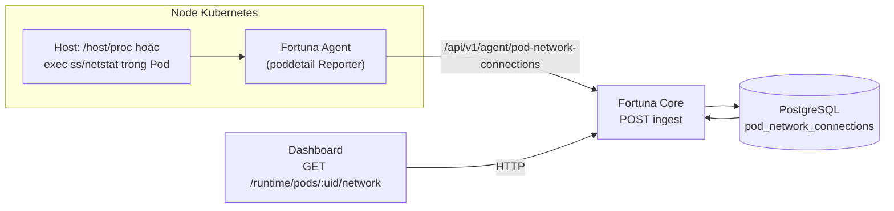

# Network Activity — Component Fortuna (triển khai hiện tại)

Tài liệu này mô tả **component Network Activity đang chạy trong codebase** (Agent Pod Detail → Core API → PostgreSQL → Dashboard Pod Detail). Nó bổ sung và đối chiếu với [`networkActivity_Spec.md`](./networkActivity_Spec.md) — file spec kia chủ yếu là **hướng tiến hóa** (eBPF, Redis/TimescaleDB, graph thời gian thực) chưa được triển khai đầy đủ như sơ đồ trong đó.

---

## 1. Vai trò trong sản phẩm

| Khía cạnh | Mô tả |
|-----------|--------|
| **Mục tiêu** | Cho phép vận hành xem **snapshot kết nối mạng theo Pod** (tuple IP/port/protocol/state), nguồn thu thập, và gợi ý bất thường queue (R5). |
| **Phạm vi** | **Theo Pod**, đồng bộ với các dịch vụ Pod Detail khác (runtime metrics, processes, events). Không có trang “Network Center” độc lập hay graph toàn cluster trong bản hiện tại. |
| **Người dùng** | Mở **Pod Detail** trên Dashboard; tab/section network hiển thị danh sách connection và metadata `runtimeSource`. |

---

## 2. Luồng dữ liệu (E2E)

1. **Agent** (package `agent/internal/poddetail`): theo chu kỳ liệt kê Pod trên node, thu thập connection cho từng `podUid`.
2. **Ingest Core**: `POST /api/v1/agent/pod-network-connections` — lưu batch vào bảng `pod_network_connections`, tùy chọn sinh `RuntimeEvent` (anomaly queue spike).
3. **Đọc API**: `GET /runtime/pods/:uid/network` — tối đa **500** bản ghi mới nhất theo `observed_at DESC`.
4. **Dashboard**: `getPodNetworkConnections(podUid)` → hiển thị trong `PodDetail.tsx`.

---

## 3. Hai chế độ thu thập (Agent)

Biến môi trường trung tâm: `POD_DETAIL_RUNTIME_SOURCE` (xem `useHostRuntime()` trong `agent/internal/poddetail/reporter.go`).

| Giá trị / hành vi | Nguồn dữ liệu |
|------------------|----------------|
| `host`, `true`, `1` | Luôn đọc từ **namespace mạng của process** trên host: `/proc/<pid>/net/tcp|udp`, map PID → container → Pod qua cgroup (`CollectNetworkFromHost`). |
| `exec` | Chạy `ss` / `netstat` **trong từng container** qua Kubernetes exec (`CollectNetworkFromPod`). Container thiếu tool → bỏ qua, hạn chế log spam. |
| `auto` hoặc **không set** | Nếu đọc được `POD_DETAIL_PROC_ROOT` (mặc định `/host/proc`) thì dùng **host**; ngược lại **exec**. |

**Ghi chú triển khai**

- Chế độ **host** phù hợp DaemonSet mount `hostPID` + `/host/proc` (Host Inspection). Không map được cgroup → danh sách connection có thể rỗng; **không** fallback exec khi đã chọn host (tránh spam “container not found”).
- **Bytes**: trường `bytesSent` / `bytesRecv` trên model và UI được comment là **snapshot queue** từ `/proc/net/*`, **không** phải tổng byte lưu lượng tích lũy session.

---

## 4. Hợp đồng API

### 4.1 Ingest (Agent → Core)

- **Method / path**: `POST /api/v1/agent/pod-network-connections`
- **Body (JSON)** (rút gọn): `podUid`, `clusterId`, `namespace`, `connections[]`, tùy chọn `runtimeSource` (`host` \| `exec`).
- **Hành vi**: ghi `PodNetworkConnection` với `observed_at` = thời điểm ingest; `OnConflict` có thể bỏ qua trùng (theo implementation GORM); broadcast cập nhật Pod Detail qua WebSocket topic `network` khi có connection.

### 4.2 Đọc (Dashboard / client)

- **Path**: `GET /runtime/pods/:uid/network`
- **Query**: `sinceMinutes` (mặc định **1440** = 24h), `limit` (mặc định 500, tối đa 2000). Lọc theo **`bucket_5m`** (bucket 5 phút UTC) ≥ `floor5m(now − since)`.
- **Response**: `{ podUid, items: PodNetworkConnection[] }`; mỗi item có thể có `bucket5m`.
- **Ingest**: cùng một signature trong một bucket 5 phút → **UPSERT** (cập nhật `observed_at`/`bytes_*`/`runtime_source` theo snapshot mới nhất), giảm bùng nổ row khi poll 2 phút.

### 4.2b Retention (Core)

- Job nền: `PodNetworkRetentionJob` — xóa theo `bucket_5m` cũ hơn retention.
- Env: `POD_NETWORK_RETENTION_HOURS` (mặc định 24), `POD_NETWORK_CLEANUP_INTERVAL` (mặc định `10m`), `POD_NETWORK_CLEANUP_BATCH` (20000), `POD_NETWORK_CLEANUP_ROUNDS` (3).

### 4.3 Toàn cluster / workload (Dashboard “Network activity”)

- **Path**: `GET /api/v1/runtime/network-activity`
- **Query**:
  - `cluster` (bắt buộc): id cluster (sau `NormalizeClusterID`).
  - `view`: `connections` (mặc định) — mỗi dòng một kết nối; `pods` — gom theo Pod (`COUNT(*)`, `MAX(observed_at)`).
  - `namespace`, `q` (tìm theo tên pod / namespace / IP đích / cổng — tùy view), `sinceMinutes` (nếu > 0: lọc `bucket_5m >= floor5m(now − since)`), `page`, `pageSize` (tối đa 200).
- **JOIN**: `pods` (LEFT) để hiển thị `podName`, `ownerKind`, `ownerName`, `nodeName` khi inventory còn pod.
- **UI**: trang `#/network-activity` — lọc theo cluster chọn trên thanh điều khiển, liên kết mở Pod Detail.

---

## 5. Mô hình dữ liệu (PostgreSQL)

Bảng: `pod_network_connections` (migration 071, `runtime_source` migration 074, **`bucket_5m` + unique signature** migration 115).

Các trường chính (khớp `core/pkg/models/pod_network_connection.go`):

- `pod_uid`, `cluster_id`, `namespace`, `container_name`
- `source_ip`, `source_port`, `dest_ip`, `dest_port`, `protocol`, `state`
- `bytes_sent`, `bytes_recv` (ý nghĩa queue — xem comment model)
- `observed_at`, `created_at`, `runtime_source`, **`bucket_5m`** (mốc 5 phút UTC cho upsert/query)

**Dọn dữ liệu**: khi Pod bị xóa khỏi DB đồng bộ, Core có thể xóa network connections theo `pod_uid` (xem `agent_service` cleanup).

---

## 6. Phát hiện bất thường (R5 — queue spike)

Trong `IngestPodNetworkConnectionsPayload`, sau khi nhận snapshot, Core gọi `buildNetworkQueueSpikeEvents`: so sánh **bytes_sent + bytes_recv** hiện tại với **baseline** (trung bình theo cửa sổ thời gian, nhóm theo container + dest + port + protocol).

**Biến môi trường** (mặc định trong code):

| Biến | Ý nghĩa |
|------|---------|
| `POD_DETAIL_NET_SPIKE_WINDOW_MINUTES` | Cửa sổ baseline (mặc định 30 phút). |
| `POD_DETAIL_NET_SPIKE_MIN_SAMPLES` | Số mẫu tối thiểu để tin baseline (mặc định 5). |
| `POD_DETAIL_NET_SPIKE_MULTIPLIER` | Ngưỡng so với trung bình (mặc định 4.0). |
| `POD_DETAIL_NET_SPIKE_MIN_QUEUE_BYTES` | Lọc nhiễu tuyệt đối (mặc định 4096). |
| `POD_DETAIL_NET_SPIKE_COOLDOWN_MINUTES` | Tránh lặp event (mặc định 10 phút). |

Event sinh ra: `Capability = NETWORK_TXRX_QUEUE_SPIKE`, `Syscall = connect`, `TargetPath` mô tả ratio/avg/samples.

---

## 7. Dashboard (TypeScript)

- **Type**: `PodNetworkConnectionItem` trong `dashboard/types.ts` — khớp JSON API; comment rõ bytes là tx/rx queue.
- **API client**: `getPodNetworkConnections` → `GET /runtime/pods/{uid}/network`.
- **UX**: nếu không có dữ liệu, copy gợi ý bật thu thập trên agent (`PodDetail.tsx`).

---

## 8. Giới hạn & khác biệt so với `networkActivity_Spec.md`

| Chủ đề | Spec dài (networkActivity_Spec.md) | Thực tế repo |
|--------|-------------------------------------|--------------|
| Thu thập | eBPF DaemonSet, metadata kernel | `/proc` host hoặc **exec** `ss` trong container |
| Lưu trữ | Redis Streams, TimescaleDB, nén protobuf | **PostgreSQL** rows, giới hạn 500 rows/query |
| UI | Graph toàn cluster, flow list tách biệt | **Pod Detail** — bảng connections |
| Thời gian thực | WebSocket flow stream | WebSocket **cập nhật Pod Detail** sau ingest, không phải stream từng flow |

Việc **lấp khoảng cách** (eBPF, retention tier, graph) là đường **roadmap**; component hiện tại nên được test và vận hành theo bảng trên.

---

## 9. Kiểm thử / vận hành gợi ý

1. Xác nhận Agent có quyền exec hoặc mount `/host/proc` đúng manifest.
2. Đặt `POD_DETAIL_RUNTIME_SOURCE=host` trên node có Host Inspection; hoặc `exec` trên image đủ `ss`/`netstat`.
3. Gọi ingest thủ công (nếu cần) và kiểm tra `SELECT count(*) FROM pod_network_connections WHERE pod_uid = '...'`.
4. Mở Pod Detail, kiểm tra `runtimeSource` và số connection.
5. Điều chỉnh env R5 nếu false positive/negative trên workload nhiều kết nối ngắn hạn.

---

## 10. Tham chiếu mã nguồn

| Thành phần | Đường dẫn |
|------------|-----------|
| Thu thập exec | `agent/internal/poddetail/network_collector.go` |
| Thu thập host | `agent/internal/poddetail/host_network.go` |
| Gửi Core | `agent/internal/poddetail/reporter.go` (`sendNetworkConnectionsForPod`) |
| Ingest + GET + R5 | `core/internal/api/pod_detail_services_handlers.go` |
| Model | `core/pkg/models/pod_network_connection.go` |
| Route agent | `core/internal/api/routes.go` |
| Route runtime | `core/internal/api/routes_runtime.go` |
| UI | `dashboard/pages/PodDetail.tsx`, `dashboard/lib/api.ts` |

---

*Tài liệu này phản ánh kiến trúc tại thời điểm bảo trì; khi merge tính năng mới (eBPF, retention), cập nhật mục 8 và sơ đồ mục 2.*
