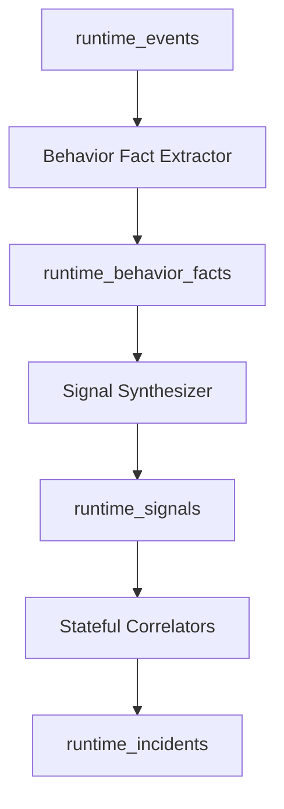

# FORTUNA_RUNTIME_SIGNAL_MODEL.md

## Status
Draft v1.0

## Normative ADRs (G-SEM-02 / G-REP-GOV-01)
- [ADR-002: Signal & incident lifecycle](../../../adr/002-runtime-signal-incident-lifecycle.md)
- [ADR-004: REP-C detector governance](../../../adr/004-rep-detector-governance.md)

## Purpose
This document defines the runtime signal model for Fortuna.

It specifies:

- behavior facts
- runtime signal taxonomy
- signal metadata model
- MITRE ATT&CK mapping
- detector contracts
- signal persistence and lifecycle

Runtime signals are the **semantic security layer** between raw runtime evidence and higher-order risk reasoning.

---

# 1. Goals

## 1.1 Primary Goals
- Transform runtime events into meaningful, source-independent security semantics.
- Separate:
  - raw evidence
  - normalized behavior
  - security-relevant signals
  - correlated runtime incidents
- Provide a stable taxonomy for:
  - capability promotion
  - runtime-aware risk rules
  - explainable findings
  - UI coverage views

## 1.2 Non-Goals
This document does not define:
- capability logic
- risk scoring model
- final insight scoring

---

# 2. Runtime Semantics Pipeline

---

## 3. Core Concepts

### 3.1 Runtime Event

A canonical, immutable runtime evidence record.

Defined in: `FORTUNA_RUNTIME_EVENT_MODEL.md`.

### 3.2 Behavior Fact

A normalized behavioral primitive extracted from runtime events.

Examples: process executed, file read, network connect, shell spawned, token file touched.

Behavior facts are not yet security conclusions.

### 3.3 Runtime Signal

A security-relevant semantic derived from one or more behavior facts.

Examples: suspicious shell execution, credential access, external egress, host path access.

Signals are designed to be: source-independent, explainable, promotable into capability reasoning.

### 3.4 Runtime Incident

A correlated, stateful runtime condition derived from multiple facts/signals over time.

Examples: post-exploitation execution chain, recon activity pattern, exfil-like sequence.

---

## 4. Behavior Facts

### 4.1 Purpose

Behavior facts form the normalized semantic bridge between raw telemetry and security logic.

They should be:

low-level enough to remain reusable
high-level enough to avoid source-specific parsing everywhere

### 4.2 Behavior Fact Schema

{
  "fact_id": "uuid",
  "event_id": "runtime-event-id",
  "observed_at": "2026-03-26T10:01:02Z",
  "asset_ref": {
    "cluster_id": "prod-cluster",
    "pod_uid": "pod-uid",
    "container_id": "containerd://abc"
  },
  "fact_type": "PROCESS_EXEC",
  "domain": "execution",
  "attributes": {
    "exe": "/bin/sh",
    "cmdline": "/bin/sh -c curl ...",
    "path": "/var/run/secrets/kubernetes.io/serviceaccount/token",
    "operation": "read",
    "dst_ip": "8.8.8.8",
    "dst_port": 53
  },
  "source_ref": {
    "source_kind": "falco",
    "source_rule": "Terminal shell in container"
  }
}

### 4.3 Behavior Fact Design Rules

Rules

Facts must be deterministic and reproducible from accepted runtime events.
Facts must avoid Fortuna-specific risk conclusions.
Facts should be replay-safe.
Multiple facts may be emitted from one runtime event.

### 4.4 Canonical Behavior Fact Types

Execution

PROCESS_EXEC
INTERACTIVE_SHELL
INTERPRETER_EXEC
TMP_BINARY_EXEC
REMOTE_TOOL_EXEC
Filesystem
FILE_READ
FILE_WRITE
FILE_EXEC
FILE_CREATE
FILE_DELETE
SERVICEACCOUNT_TOKEN_READ
SECRET_FILE_READ
HOST_PATH_TOUCH
BINARY_DROP
Network
NETWORK_CONNECT
DNS_QUERY
EXTERNAL_CONNECT
INTERNAL_LATERAL_CONNECT
HIGH_FANOUT_CONNECT
Privilege / Escape
PRIVILEGE_BOUNDARY_TOUCH
HOST_NAMESPACE_TOUCH
KERNEL_SENSITIVE_ACTION
CAPABILITY_SENSITIVE_ACTION
Credential / Secret Access
CREDENTIAL_MATERIAL_READ
CLOUD_METADATA_ACCESS
SSH_KEY_TOUCH
K8S_API_TOKEN_TOUCH
Discovery / Recon
PROCESS_ENUMERATION
FILE_SYSTEM_ENUMERATION
NETWORK_RECON
K8S_RECON
Defense Evasion
SECURITY_ARTIFACT_TAMPER
HISTORY_CLEAR_ATTEMPT
PROC_HIDE_ATTEMPT
LOG_TAMPER
Persistence / Staging
REMOTE_PAYLOAD_FETCH
PERSISTENCE_ARTIFACT_WRITE
CRON_MODIFICATION
STARTUP_SCRIPT_MODIFICATION
5. Runtime Signal Model
5.1 Signal Purpose

Runtime signals express security semantics from behavior.

Signals are intended to be:

more meaningful than raw events
more stable than source-native detections
easier to reason about in rules and scoring
5.2 Runtime Signal Schema
{
  "signal_id": "uuid",
  "signal_type": "SERVICEACCOUNT_TOKEN_READ",
  "domain": "credentials",
  "severity_hint": "high",
  "confidence": "medium",
  "first_seen_at": "2026-03-26T10:01:02Z",
  "last_seen_at": "2026-03-26T10:01:02Z",
  "count": 1,
  "asset_ref": {
    "cluster_id": "prod-cluster",
    "pod_uid": "pod-uid",
    "container_id": "containerd://abc"
  },
  "evidence_refs": [
    "event:123",
    "fact:456"
  ],
  "metadata": {
    "path": "/var/run/secrets/kubernetes.io/serviceaccount/token",
    "exe": "/bin/sh"
  },
  "mitre": {
    "tactic": "Credential Access",
    "techniques": ["T1552"]
  },
  "source_coverage": {
    "falco": true,
    "ebpf": false,
    "tetragon": false,
    "tracee": false
  }
}
5.3 Signal Design Rules
Rules
A signal must represent a meaningful runtime security condition.
A signal must be source-independent.
A signal must preserve evidence references.
A signal may be emitted:
directly from a fact
from a set of facts
from a stateful detector
6. Runtime Taxonomy

Fortuna runtime signals are grouped into 8 domains.

6.1 Domain: Execution
Signal Types
SUSPICIOUS_PROCESS_EXEC
INTERACTIVE_SHELL_EXEC
TMP_BINARY_EXECUTION
INTERPRETER_ABUSE
REMOTE_TOOL_EXECUTION
UNEXPECTED_EXEC_PATH
Typical Use

Used to identify suspicious code execution behavior inside workloads.

Example Evidence
/bin/sh in container
/tmp/a.out execution
python -c ...
curl | sh
6.2 Domain: Filesystem
Signal Types
SENSITIVE_FILE_ACCESS
SENSITIVE_FILE_MODIFICATION
SERVICEACCOUNT_TOKEN_READ
HOST_PATH_ACCESS
BINARY_STAGING
AUDIT_ARTIFACT_TAMPER
Typical Use

Used to identify file-level access or tampering with high security relevance.

6.3 Domain: Network
Signal Types
EXTERNAL_EGRESS
DNS_ANOMALY
PORT_SCAN_LIKE_ACTIVITY
C2_LIKE_CONNECTION
LATERAL_CONNECT_ATTEMPT
INTERNAL_RECON_TRAFFIC
Typical Use

Used to identify suspicious network behavior such as command-and-control, scanning, or outbound execution behavior.

6.4 Domain: Privilege / Escape
Signal Types
PRIVILEGE_ESCALATION_ATTEMPT
CAPABILITY_ABUSE
HOST_NAMESPACE_ACCESS
CONTAINER_ESCAPE_PRIMITIVE
KERNEL_SENSITIVE_BEHAVIOR
Typical Use

Used to detect execution paths associated with privilege expansion or container escape primitives.

6.5 Domain: Credential / Secret Access
Signal Types
CREDENTIAL_ACCESS
SECRET_MATERIAL_ACCESS
K8S_API_TOKEN_USE
SSH_KEY_ACCESS
CLOUD_METADATA_ACCESS
Typical Use

Used to detect runtime interaction with credential or secret material.

6.6 Domain: Defense Evasion
Signal Types
SECURITY_TOOL_TAMPERING
PROCESS_HIDE_ATTEMPT
HISTORY_CLEARING
AUDIT_EVASION
ARTIFACT_CLEANUP
Typical Use

Used to identify attempts to reduce visibility or tamper with forensic evidence.

6.7 Domain: Discovery / Recon
Signal Types
ENVIRONMENT_DISCOVERY
K8S_RECON_ACTIVITY
PROCESS_ENUMERATION_ACTIVITY
FILESYSTEM_ENUMERATION_ACTIVITY
NETWORK_RECON_ACTIVITY
Typical Use

Used to identify runtime reconnaissance or situational awareness gathering.

6.8 Domain: Persistence / Staging
Signal Types
PERSISTENCE_ATTEMPT
REMOTE_PAYLOAD_FETCH
BINARY_STAGING
CRON_MODIFICATION
STARTUP_SCRIPT_TAMPER
Typical Use

Used to identify runtime artifact staging or persistence behavior.

7. Signal Metadata Registry

Each signal type must be registered with metadata.

7.1 Signal Metadata Schema
{
  "signal_type": "SERVICEACCOUNT_TOKEN_READ",
  "domain": "credentials",
  "severity_hint": "high",
  "default_confidence": "medium",
  "promotable_capabilities": [
    "OBSERVED_K8S_API_ACCESS"
  ],
  "mitre": {
    "tactic": "Credential Access",
    "techniques": ["T1552"]
  },
  "default_decay_window": "24h",
  "ui_group": "credential-access"
}
7.2 Required Signal Metadata Fields

Each registered signal must define:

signal_type
domain
severity_hint
default_confidence
mitre.tactic
default_decay_window

Optional:

promotable_capabilities
ui_group
coverage_tags
8. MITRE ATT&CK Mapping

Signals should be mapped to ATT&CK where meaningful.

8.1 Mapping Rules
Rules
MITRE mapping is for analytical coverage and operator understanding.
MITRE mapping must not be treated as primary detection logic.
One signal may map to:
one tactic
multiple techniques
8.2 Example Mappings
Signal Type	Tactic	Technique
INTERACTIVE_SHELL_EXEC	Execution	T1059
SERVICEACCOUNT_TOKEN_READ	Credential Access	T1552
CLOUD_METADATA_ACCESS	Credential Access	T1552.005
PORT_SCAN_LIKE_ACTIVITY	Discovery	T1046
HOST_NAMESPACE_ACCESS	Privilege Escalation	T1611
REMOTE_PAYLOAD_FETCH	Command and Control / Execution	T1105
AUDIT_EVASION	Defense Evasion	T1070
9. Detector Model

Detectors transform behavior facts into signals or incidents.

There are two detector classes:

stateless detectors
stateful detectors
9.1 Stateless Detector Contract

Used when one fact or one event is enough to emit a signal.

Example
file read of serviceaccount token
shell execution
outbound connection to public IP
Stateless Detector Schema
id: serviceaccount_token_read
type: stateless
inputs:
  - SERVICEACCOUNT_TOKEN_READ
match:
  path_equals:
    - /var/run/secrets/kubernetes.io/serviceaccount/token
emit_signal: SERVICEACCOUNT_TOKEN_READ
severity_hint: high
confidence: medium
9.2 Stateful Detector Contract

Used when multiple facts/signals over time are needed.

Example
shell → curl → chmod → exec /tmp
many ports to same destination
repeated sensitive file reads
Stateful Detector Schema
id: post_exploit_exec_chain
type: stateful
window: 5m
group_by:
  - pod_uid
  - container_id
requires:
  - INTERACTIVE_SHELL
  - REMOTE_PAYLOAD_FETCH
  - TMP_BINARY_EXEC
emit_incident: POST_EXPLOIT_EXEC_CHAIN
confidence: high
suppression:
  cooldown: 30m
10. Detector Design Rules
Rules
Detectors must be deterministic and replay-safe.
Detectors must preserve evidence references.
Detectors must tolerate out-of-order event arrival within bounded windows.
Detector output must be idempotent.
11. Runtime Incidents

Runtime incidents represent correlated, stateful security conclusions.

They are higher-order than signals and should be used as:

risk engine input
capability evidence
explainable timeline artifacts
11.1 Runtime Incident Schema
{
  "incident_id": "uuid",
  "incident_type": "POST_EXPLOIT_EXEC_CHAIN",
  "severity_hint": "critical",
  "confidence": "high",
  "first_seen_at": "2026-03-26T10:01:02Z",
  "last_seen_at": "2026-03-26T10:03:10Z",
  "asset_ref": {
    "cluster_id": "prod-cluster",
    "pod_uid": "pod-uid"
  },
  "evidence_refs": [
    "signal:abc",
    "signal:def",
    "signal:ghi"
  ],
  "window": "5m",
  "metadata": {
    "sequence": [
      "INTERACTIVE_SHELL_EXEC",
      "REMOTE_PAYLOAD_FETCH",
      "TMP_BINARY_EXECUTION"
    ]
  }
}
12. Persistence Model
12.1 Tables

Recommended tables:

runtime_behavior_facts
runtime_signals
runtime_incidents
12.2 Suggested Indexes
runtime_behavior_facts
(pod_uid, observed_at DESC)
(fact_type, observed_at DESC)
runtime_signals
(pod_uid, signal_type, last_seen_at DESC)
(domain, last_seen_at DESC)
runtime_incidents
(pod_uid, incident_type, last_seen_at DESC)
(severity_hint, last_seen_at DESC)
13. Signal Lifecycle

Signals should support:

first_seen_at
last_seen_at
count
evidence accumulation
confidence updates
decay windows

Signals are not immutable logs; they are rolling semantic state.

14. Coverage Model

Fortuna should track runtime coverage across:

source coverage
signal coverage
MITRE coverage
detector coverage
scenario coverage

Recommended use cases:

dashboard coverage view
runtime maturity reporting
regression testing
15. Summary

Fortuna runtime signals provide the semantic bridge between:

runtime telemetry
capability inference
runtime-aware risk evaluation

The model separates:

raw runtime events
behavior facts
semantic signals
correlated runtime incidents

This separation is mandatory if Fortuna is to become a true runtime-aware risk platform instead of a dressed-up event viewer.