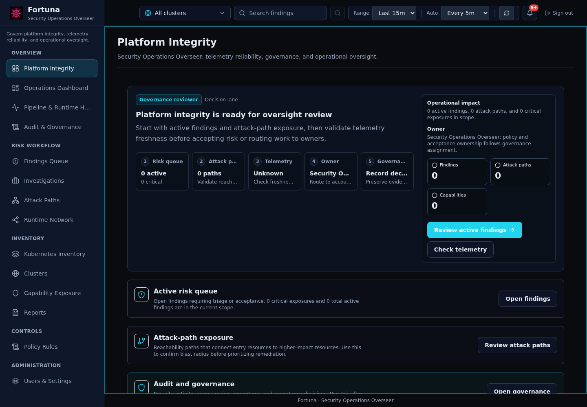
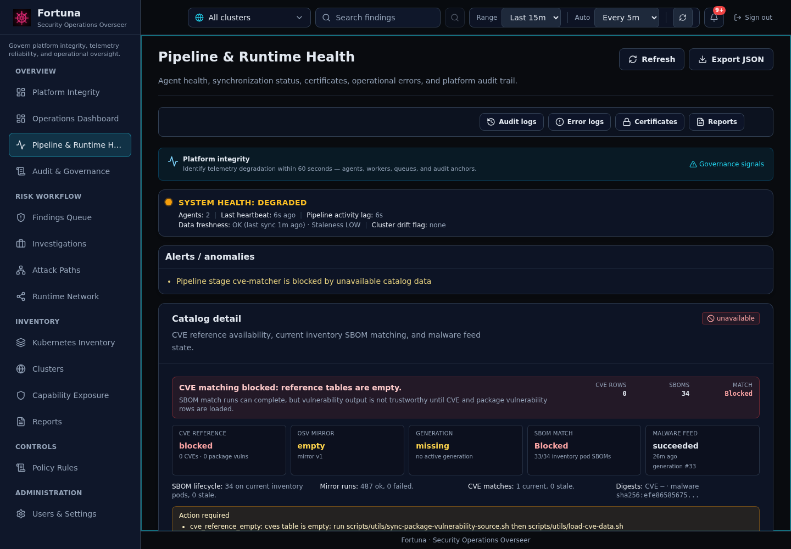
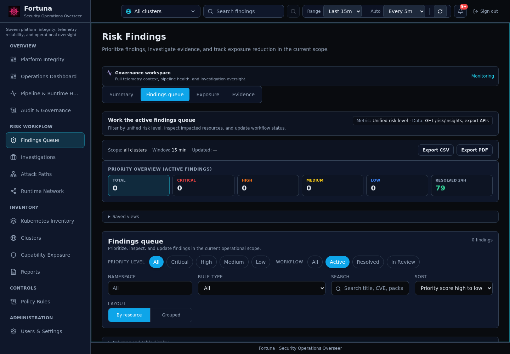
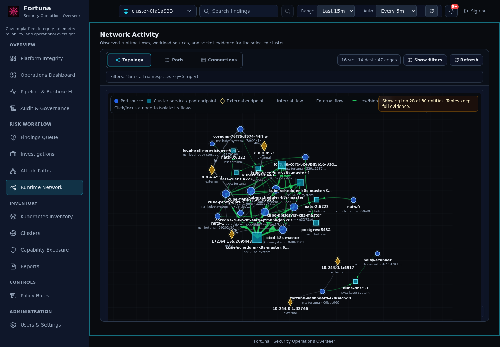
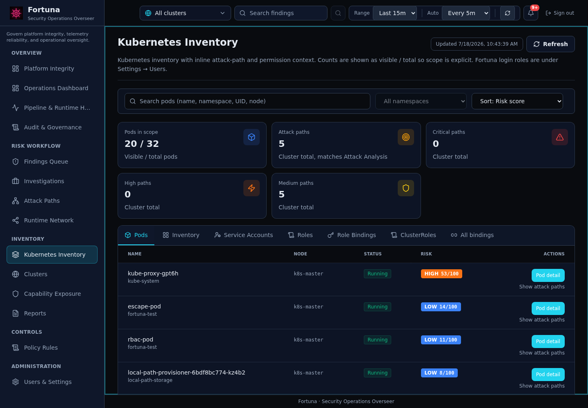
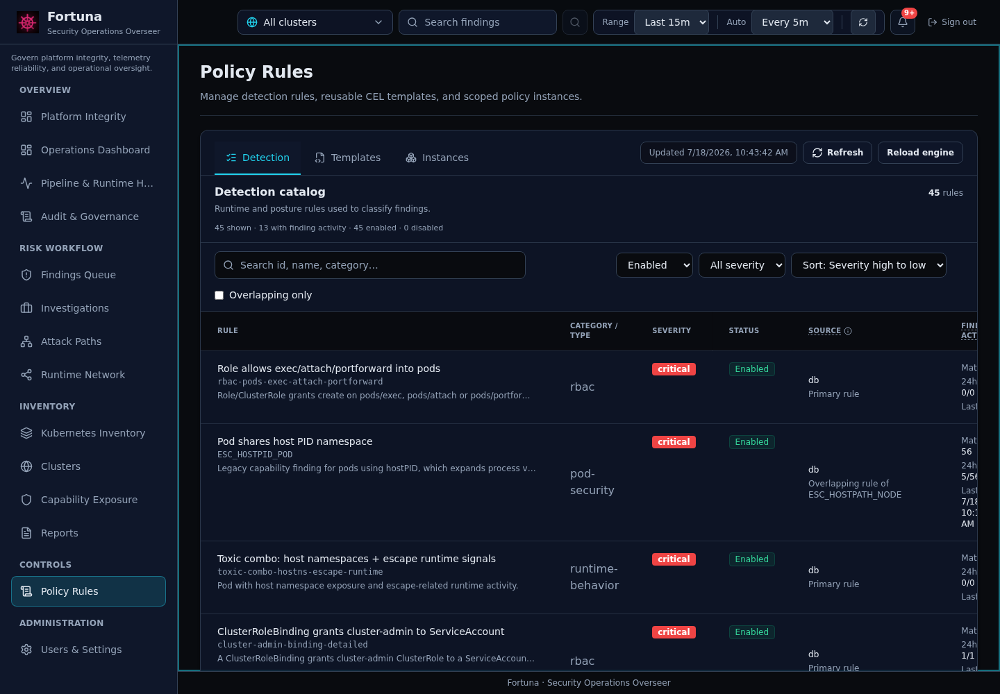
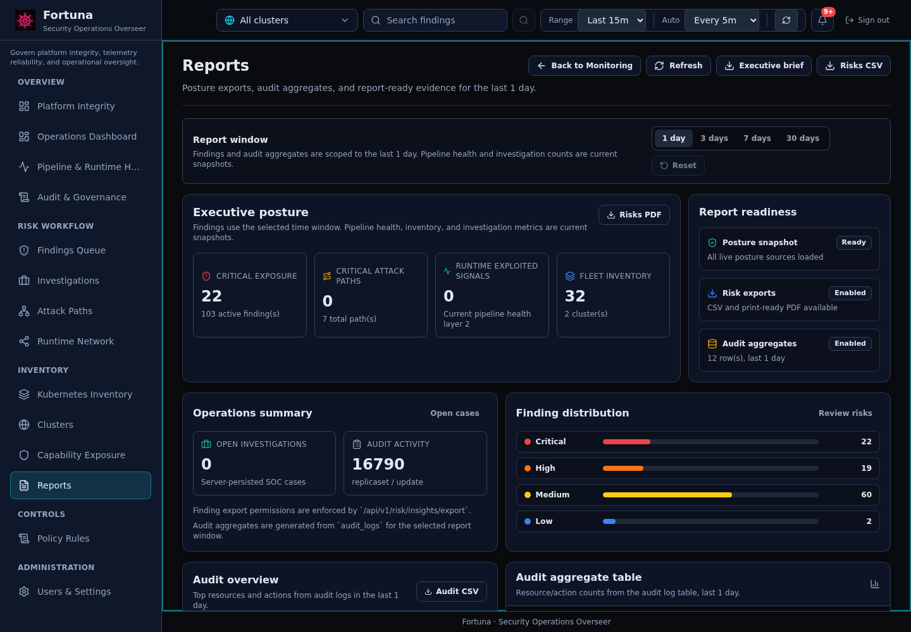

# User Guide

Fortuna is organized around operational workspaces. Use the left navigation after signing in.

## Access

Open the dashboard URL exposed by port-forward or your ingress. Local development usually uses:

```bash
kubectl port-forward --address 0.0.0.0 -n fortuna svc/fortuna-dashboard 8081:80
```

Then open `http://127.0.0.1:8081/`.

Development login:

- Username: `admin`
- Password: `<FORTUNA_ADMIN_PASSWORD>`, or `Fortuna_ChangeMe_123!` for a fresh bootstrap deploy where no admin password was configured. The bootstrap default must be changed at first login and never overwrites an existing admin. When `FORTUNA_ADMIN_PASSWORD` is set, Core re-applies it on every restart, so change the admin password through that Secret rather than only in the UI.

Roles determine route visibility and actions:

| Role | Main purpose |
|------|--------------|
| Admin | Full platform, security, policy, monitoring, and user administration. |
| User admin | Fortuna account administration only. No cluster or finding access. |
| Operator | Day-to-day investigation, triage, rules, runtime, and risk workflows. |
| Viewer | Read-oriented security posture and evidence review. |

## Main Workspaces

| Workspace | Route | Use it for |
|-----------|-------|------------|
| Platform Integrity | `/#/` | Telemetry reliability, governance, runtime coverage, and platform health. |
| Operations Dashboard | `/#/dashboard` | Executive summary of risk, exposure, attack paths, and cluster posture. |
| Findings Queue | `/#/risks/findings` | Triage findings using the unified risk score and workflow status. |
| Attack Paths | `/#/attack-paths` | Review attack paths, RBAC escalation, lateral movement, and runtime attack-step evidence. |
| Runtime Network | `/#/network-activity` | Inspect pod-to-pod and external network activity. |
| Kubernetes Inventory | `/#/resources` | Browse pods and open pod detail for SBOM, risk, runtime, events, and spec. |
| Policy Rules | `/#/rules` | Review rule catalog metadata and linked findings. |
| Pipeline & Runtime Health | `/#/monitoring` | Verify pipeline processing, runtime event ingestion, Falco/eBPF visibility, and data freshness. |
| Reports | `/#/reports` | Export and review time-windowed operational reports. |
| Settings | `/#/settings` | Manage users, roles, sessions, and administrative controls. |

## Cluster Scope

The header cluster selector controls most security data pages.

- `All clusters` is useful for Platform Integrity, Operations Dashboard, global finding triage, and reports.
- A specific cluster is required for Runtime Network and is recommended when investigating pod detail, attack paths, or inventory.
- If a remote cluster Agent is connected, it appears in the selector after its first full sync. Dashboard totals should equal the sum of active cluster rows.

## Workspace Screenshots

These images are representative captures from one local multi-cluster deployment. Your data, cluster name, and health states may differ.

### Platform Integrity



### Pipeline & Runtime Health



### Findings Queue



### Attack Paths


### Runtime Network



### Kubernetes Inventory



### Policy Rules



### Reports



## Reading Empty or Blocked States

| State | Meaning | Action |
|-------|---------|--------|
| Unauthenticated | The JWT/session is missing or expired. | Sign in again. |
| Forbidden | Your role lacks the required permission. | Ask an admin to update role or permission grants. |
| Cluster scope | You selected or opened a cluster outside your assigned scope. | Change cluster selector or request access. |
| No telemetry | The page needs Agent or runtime data that has not arrived for this cluster. | Check Pipeline & Runtime Health and the Agent or sensor for that cluster. |
| No data | The route is allowed and data is flowing, but current filters have no records. | Clear filters or widen the time range. |
| Stale | Data exists but its freshness checks failed, so it may not reflect the cluster now. | Check data timestamps and Agent sync before acting on it. |

## Common Navigation Flow

1. Start at Platform Integrity to confirm data freshness and runtime coverage.
2. Open Findings Queue and sort by unified risk score.
3. Open a finding drawer or full detail page to inspect evidence.
4. Jump to Attack Paths for path context.
5. Open the affected pod in Kubernetes Inventory for SBOM, runtime, network, and event detail.
6. Use Policy Rules to understand the rule or catalog entry behind the finding.
7. Export from Reports when you need a time-windowed operational handoff.
