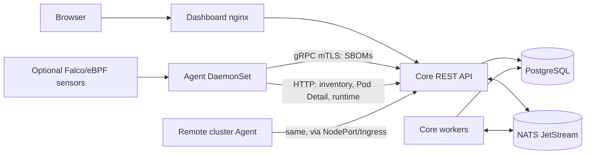
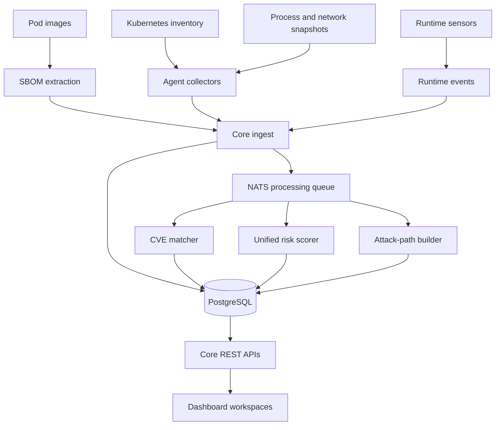
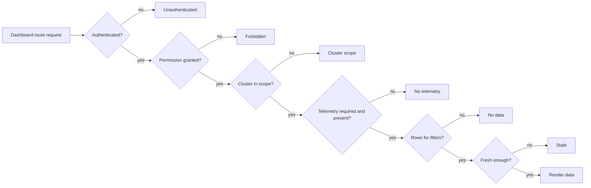

# Architecture

Fortuna is a Kubernetes security platform for workload inventory, SBOM/CVE visibility, runtime telemetry, policy/rule evidence, attack-path analysis, and unified risk operations.

## Runtime Topology

Dashboard is a projection of Core APIs. The Agent sends SBOMs over gRPC with a per-Agent client certificate, and inventory, Pod Detail and runtime evidence over HTTP with a per-Agent token ([Agent identity](../reference/AGENT_IDENTITY.md)). Agent and optional sensors write evidence into Core; Core persists source-of-truth state and publishes asynchronous processing work through NATS JetStream.

In multi-cluster deployments, Core/Dashboard/PostgreSQL/NATS run once in the management cluster. Remote clusters run Agent only. Every inventory, SBOM, runtime, network, risk, and attack-path record is owned by `cluster_id`; dashboard cluster totals are computed from active cluster-scoped records.

## Workloads

| Component | Kubernetes shape | Code | Purpose |
|-----------|------------------|------|---------|
| Core | Deployment + Service | `core/` | REST API, gRPC ingest, workers, migrations, risk, policy, runtime and SBOM processing |
| Agent | DaemonSet | `agent/` | Per-node inventory, SBOM extraction, Pod Detail snapshots, network observations, Falco ingestion |
| Dashboard | Deployment + Service | `dashboard/` | React UI served by nginx; proxies `/api/*` to Core |
| PostgreSQL | Deployment + PVC | `deploy/infrastructure/postgresql.yaml` | Source of truth for inventory, SBOM, CVE, risk, runtime, users and reports |
| NATS JetStream | StatefulSet | `deploy/infrastructure/nats.yaml` | Async queue for SBOM and event pipelines |

Core runs migrations at startup. `/healthz` only reports that the process is up; `/status` checks PostgreSQL (NATS is not checked) (see [Core health endpoints](../../core/README.md#health-endpoints)). If the Dashboard shows no Pod Detail or runtime data, check the Agent DaemonSet, its connection to Core and its node permissions first. Details for each component are in [Core](../../core/README.md), [Agent](../../agent/README.md) and [Dashboard](../../dashboard/README.md).

## Data Ownership

PostgreSQL is the source of truth for user-visible state. Dashboard pages should be treated as projections of Core API data, not as independent state machines.

Cluster identity is part of the primary data contract. Agent either auto-discovers a stable cluster id from the Kubernetes API or uses explicit `CLUSTER_ID` / `CLUSTER_NAME` overrides. Core upserts clusters by id and never uses display name as ownership identity.

| Data Area | Source | Used By |
|-----------|--------|---------|
| Inventory | Agent pod sync and Kubernetes API observations | Resources, Pod Detail, Monitoring, Risk |
| SBOM | Agent image/package extraction | Pod Detail, CVE, Risk |
| CVE matches | Core matcher against loaded CVE catalog | Risk, Pod Detail |
| Runtime events | Falco/eBPF/agent facts through runtime ingest | Monitoring, Pod Detail, Attack Paths, Risk |
| Network activity | Agent runtime observations | Network, Pod Detail, Attack Paths |
| Rules | Policy/rule catalog and mapped legacy identifiers | Rules, Risk evidence |
| Risk | Core unified scorer | Home, Findings, Inventory, Pod Detail |
| Findings export | `/risk/insights/export`, scoped by role, cluster and time | Executive brief on Home |

## Core Data Flows

### Inventory And Pod Detail

1. Agent watches pods on each node.
2. Agent sends pod metadata, specs, runtime snapshots, network observations, and events.
3. Core upserts inventory and pod detail records.
4. Core scopes pod cleanup to the cluster whose Kubernetes API it can actually observe. Remote cluster records are not deleted by management-cluster ghost cleanup.
5. Dashboard reads through Core APIs and must distinguish no data from missing telemetry or missing permission.

### SBOM And CVE

1. Agent extracts SBOM data for observed images.
2. Core persists package/component records.
3. Core matches packages against the CVE catalog stored in PostgreSQL.
4. CVE evidence feeds pod detail, reports, findings, and unified risk.

CVE matching needs the catalog loaded into PostgreSQL (`./scripts/utils/load-cve-data.sh`). After a database reset, an empty CVE view is not proof of a clean image until catalog load and SBOM ingestion have been verified. When a match looks wrong, compare package name, version, ecosystem and source fields.

### Unified Risk

Core exposes one user-facing risk result for resources and findings. Inputs may include:

- CVE/SBOM evidence.
- Pod configuration and capability signals.
- RBAC and attack-path context.
- Runtime and network evidence.
- Rule matches and workflow state.
- Data freshness and telemetry health where relevant.

UI pages display the same unified risk level and score across overview, resource list, Pod Detail, reports and finding detail. How findings are evaluated, scored and resolved is in [Findings and risk](../reference/FINDINGS_AND_RISK.md).

### Attack Paths

Attack paths are generated from relationships between workloads, identities, RBAC, network observations, runtime evidence, and sensitive objectives. A path shows the source workload and namespace, the target or objective, the key RBAC, network or runtime edge, its confidence and evidence type, and linked findings. It is an inference of what is possible; runtime confirmation requires matching telemetry. See [Attack graph](../reference/GRAPH.md).

### Rules

Rules holds the rule catalog, risk scoring rules and the capability catalog. Rule detail links use stable rule UIDs (`/#/rules/uid/<rule_uid>`); older code-based identifiers may still appear in imported data.

### Runtime Monitoring

Runtime visibility depends on sensor configuration and agent health. Falco is the supported runtime sensor; the built-in eBPF sensor is an experimental scaffold that collects no real exec/connect events, and `EBPF_SIMULATE=true` events are never evidence. Monitoring makes these states explicit:

- Runtime sensor disabled or not installed.
- Sensor enabled but no events observed.
- Events received and processed.
- Telemetry stale or blocked.

## Dashboard Contract

The dashboard should consistently render these states for every protected route:

| State | Meaning |
|-------|---------|
| Unauthenticated | No valid JWT/session; user must sign in |
| Forbidden | Authenticated user lacks required permission |
| Cluster scope | User has route access but not the selected cluster/scope |
| No telemetry | Route is allowed but required agent/runtime data is missing |
| No data | Request succeeded and current filters/time window have no matching records |
| Stale | Data exists but freshness checks indicate it may not reflect current runtime |

Implementation should reuse dashboard primitives where possible:

- `dashboard/design-system/layouts/PageContainer.tsx`
- `dashboard/design-system/components/PageStatus.tsx`
- `dashboard/design-system/components/SemanticEmptyState.tsx`
- `dashboard/design-system/components/FilterBar.tsx`
- `dashboard/design-system/components/Table.tsx`
- shared form/table chrome in `dashboard/lib/`

## Product domains

| Domain | What it shows | Primary data |
|--------|---------------|--------------|
| Home | What needs attention: triage, critical and exposure counts, the top unacknowledged findings, the user's open cases, data freshness, a 30-day trend by risk level, and the Executive brief (time-windowed posture and findings exports) | Findings list and summary, risk score counts, threat velocity, dashboard stats, pipeline health, investigations |
| Findings | The triage queue by workflow status (needs triage, in review, resolved, dismissed), one detail panel whose actions are shared with the finding page, and for operators capability exposure and runtime evidence | `risk_scores`, insights, rules, runtime/CVE/path evidence |
| Attack Paths | Paths from a workload to sensitive targets | RBAC graph, pod/ServiceAccount links, network/runtime evidence |
| Inventory / Pod Detail | Clusters, workload inventory, RBAC and per-pod evidence | Clusters, pods, containers, SBOM, CVE, processes, network, events |
| Network | Runtime topology and external destinations | Agent network observations |
| Rules | Rule catalog, matching metadata, linked findings | Rule catalog APIs |
| Platform | Pipeline, Agent, sensor and data freshness | Core health, pipeline state, Agent telemetry |
| Audit | Who did what in Fortuna (admin) | Security activity, platform audit log, audit summary, investigation events, permission and access analytics |

## API Shape

Core routes are grouped by product domain under `/api/v1` (plus `/api/v2/runtime`). The route map and response conventions are in [API_STANDARD.md](API_STANDARD.md).

## Repository Map

| Path | Purpose |
|------|---------|
| `agent/` | Node agent Go module |
| `api/` | Shared module: gRPC definitions, generated code and HTTP collection payloads |
| `core/` | Core API, workers, models, migrations |
| `dashboard/` | React/Vite dashboard |
| `deploy/` | Helm chart (`deploy/helm/fortuna`), the manifests rendered from it, and optional overlays |
| `scenarios/` | Reproducible attack-path validation scenarios |
| `scripts/` | Build, deploy, verify, and utility scripts |
| `docs/` | Documentation |

## Related Docs

- [User guide](../user-guide/README.md)
- [Production deployment](../operations/PRODUCTION_DEPLOYMENT.md)
- [Security guide](../reference/SECURITY.md)
