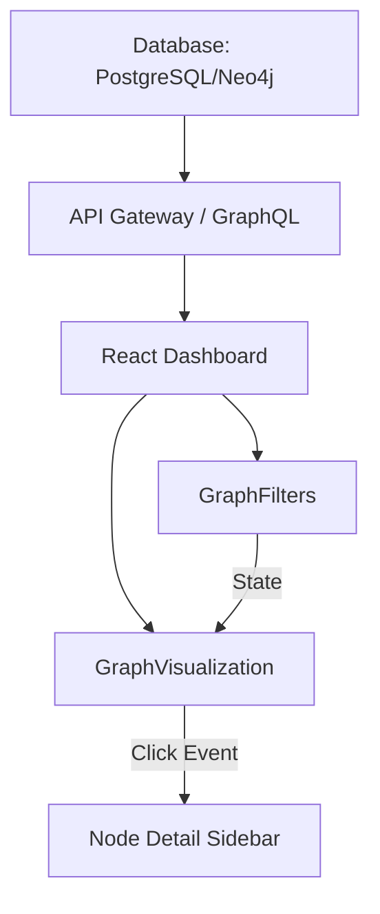

# Kubernetes ServiceAccount Graph Dashboard Enhancement Plan

## 1. Overview
This document summarizes the optimization and enhancement plan for improving the visualization and usability of the **Kubernetes ServiceAccount Management Dashboard**, focusing on two main React components:
- `GraphFilters.tsx`
- `GraphVisualization.tsx`

The goal is to create a professional, performant, and intuitive interface that helps users visualize complex relationships among **Clusters**, **Namespaces**, **Roles**, **ServiceAccounts**, and **Bindings**.

---

## 2. Current Issues

### 2.1 GraphFilters.tsx
- Static filters; not dynamically synchronized with graph data.
- No “loading” state or feedback during data updates.
- Lack of linkage between filter changes and the visualized graph.
- Overloaded layout; filters are not grouped intuitively.
- Missing state persistence or advanced search options (autocomplete, tag-based filters).

### 2.2 GraphVisualization.tsx
- Full rendering on every change causes lag with large datasets (>500 nodes).
- Uses a default layout (e.g., COSE) without hierarchy awareness (cluster → namespace → SA).
- No grouping, lazy rendering, or zoom-based filtering.
- Poor interactivity (no node detail, hover, or focus highlight).
- No mini-map, edge visibility control, or drill-down capability.

---

## 3. Objectives of Enhancement

| Goal | Description |
|------|--------------|
| **Performance Optimization** | Efficiently render thousands of nodes using lazy loading and grouping. |
| **Visual Clarity** | Highlight relationships between Clusters, Namespaces, Roles, and ServiceAccounts. |
| **Interactivity** | Enable click, hover, and zoom actions with contextual detail. |
| **Dynamic Filtering** | Real-time synchronization between filter and graph views. |
| **Scalability** | Handle multiple clusters and large data without UI degradation. |

---

## 4. Technical Improvements

### 4.1 Frontend Stack
| Component | Recommended Technology | Benefit |
|------------|-------------------------|----------|
| Graph Engine | Cytoscape.js with Dagre or Cola layouts | Optimized for hierarchical Kubernetes graphs |
| State Management | Zustand / Redux | Shared state between filters and graph |
| Rendering | useMemo + requestAnimationFrame batching | Improved FPS and reduced re-render cost |
| UI Components | HeadlessUI, ShadCN, TailwindCSS | Clean, modern interface |
| Detail Panel | Tippy.js / Drawer Sidebar | On-click node information display |

---

## 5. Data & Layout Model

### 5.1 Node Structure
```typescript
{
  id: "sa:monitoring/prometheus",
  label: "prometheus",
  type: "ServiceAccount",
  parent: "ns:monitoring",
  data: { cluster: "prod", roles: ["read", "list"], tokens: 2 }
}
```

### 5.2 Graph Hierarchy
```
Cluster
 └── Namespace
      └── Role / ClusterRole
           └── ServiceAccount
                └── Pod
```

### 5.3 Graph Rendering Flow


---

## 6. UI / UX Enhancements

### 6.1 GraphFilters.tsx
**Improvements:**
- Combine filters inside collapsible cards (Cluster / Namespace / Advanced).
- Introduce “Apply Filters” button with progress feedback.
- Support dynamic suggestions (namespace autocomplete).
- Store last-used filters in localStorage.
- Expose prop `onFiltersChange(filters)` to communicate with GraphVisualization.

### 6.2 GraphVisualization.tsx
**Enhancements:**
- Use `cytoscape-dagre` layout for vertical hierarchical display.
- Introduce **compound nodes** for grouping (Cluster → Namespace → Role → SA).
- Add features:
  - Auto zoom-fit and smooth transitions.
  - Mini-map (via cytoscape-navigator).
  - Hover tooltip with node metadata.
  - Sidebar for node detail view.
  - Lazy rendering for edges beyond zoom threshold.
- Introduce `LegendPanel` to explain colors and icons.
- Add filtering on node type visibility (toggle on/off).

---

## 7. Recommended Libraries for Visualization

| Library | Use Case | Notes |
|----------|-----------|-------|
| **Cytoscape.js** | Primary engine | Mature, plugin-rich, strong community |
| **Cytoscape-Dagre / Cola** | Layout plugin | DAG / force-directed optimized |
| **Graphin (AntV)** | Advanced visualization | Professional-grade, supports 3D and animation |
| **Reaflow** | DAG rendering in React | Lightweight, elegant, simple API |
| **Vis.js** | Real-time network visualization | Flexible but less maintained |

> Recommended: **Cytoscape.js + Dagre** for compatibility, or **Graphin** for premium visualization UX.

---

## 8. Legend and Risk Indicators

| Node Type | Color | Description |
|------------|--------|-------------|
| Cluster | 🟦 | Root infrastructure node |
| Namespace | 🟩 | Logical isolation context |
| Role / ClusterRole | 🟧 | Permission policy node |
| ServiceAccount | 🟨 | Workload identity node |
| Binding | 🔵 | Role ↔ SA relationship |

**Risk Indicators:**
- 🔴 High risk – cluster-admin or wildcard permissions  
- 🟡 Medium risk – namespace-level write privileges  
- 🟢 Low risk – read-only or non-sensitive roles  

---

## 9. Future Enhancements
- Integrate with OPA/Kyverno to validate RBAC compliance.
- Add time-based animation for token rotation or lifecycle events.
- Provide export options (PNG, JSON, or GraphML).
- Add search and path tracing (e.g., trace privilege chain from SA → ClusterRole).

---

## 10. Next Steps
1. Refactor both `GraphFilters.tsx` and `GraphVisualization.tsx` to align with new architecture.  
2. Add new components:  
   - `NodeDetailsDrawer.tsx` (on-click node details)  
   - `LegendPanel.tsx` (graph legend & node types)  
3. Integrate with the backend graph API for dynamic updates.  
4. Validate scalability using datasets from 5–10 Kubernetes clusters.

---

**Version:** 1.0  
**Author:** DevSecOps Visualization Design Team  
**Date:** 2025-11-09
